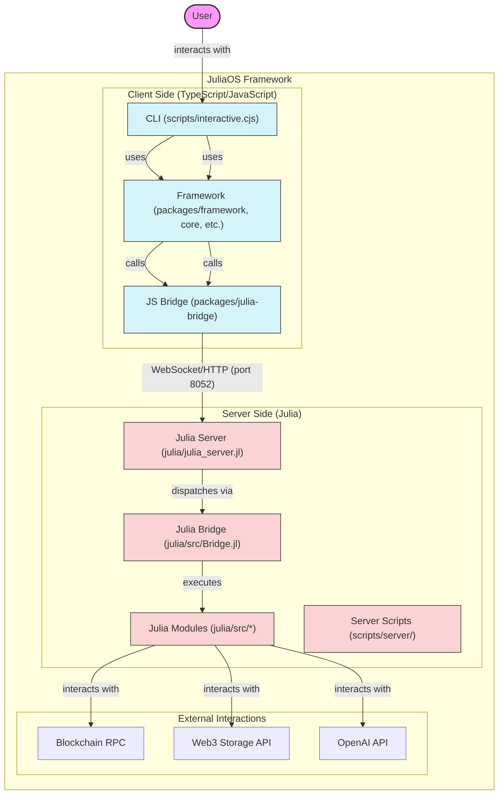

# JuliaOS Open Source AI Agent & Swarm Framework

*joo-LEE-uh-oh-ESS* /ˈdʒuː.li.ə.oʊ.ɛs/

**Noun**
**A powerful multi-chain, community driven, 3 in 1, Web3 focused project aiming at AI and Swarm technological Innovation, powered by Julia.**


## Overview

JuliaOS is a comprehensive framework for building decentralized applications (DApps) with a focus on agent-based architectures, swarm intelligence, and cross-chain trading. It provides both a CLI interface for quick deployment and a framework API for custom implementations. By leveraging AI-powered agents and swarm optimization, JuliaOS enables sophisticated trading strategies across multiple blockchains.

```mermaid
graph TD
    subgraph User Interaction
        direction LR
        UserCLI[End User via CLI]
        UserSDK[Developer via SDK]
    end

    subgraph Client Layer (TypeScript/Node.js)
        direction TB
        CLI["scripts/interactive.cjs <br> (uses packages/cli)"]
        Framework["Framework Packages <br> (packages/framework, /core, /wallets, etc.)"]
        PyWrapper["Python Wrapper <br> (packages/python-wrapper)"]
        JSBridge["JS Bridge Client <br> (packages/julia-bridge)"]

        CLI --> Framework
        UserSDK --> Framework
        UserSDK --> PyWrapper
        Framework --> JSBridge
        PyWrapper --> JSBridge
    end

    subgraph Communication Layer
        direction TB
        BridgeComms["WebSocket/HTTP <br> (Port 8052)"]
    end

    subgraph Server Layer (Julia Backend - julia/)
        direction TB
        JuliaServer["Julia Server <br> (julia_server.jl)"]
        JuliaBridge["Julia Bridge Server <br> (src/Bridge.jl)"]
        
        subgraph Core Modules (julia/src/)
            AgentSys["AgentSystem.jl"]
            Swarms["Swarms.jl <br> (DE, PSO, GWO, ACO, GA, WOA)"]
            SwarmMgr["SwarmManager.jl"]
            Blockchain["Blockchain.jl (EVM)"]
            DEX["DEX.jl (Uniswap V3)"]
            Web3Store["Web3Storage.jl <br> (Ceramic, IPFS)"]
            OpenAIAdapter["OpenAISwarmAdapter.jl"]
            SecurityMgr["SecurityManager.jl"]
            UserModules["UserModules.jl"]
        end

        JuliaServer -- receives --> JuliaBridge
        JuliaBridge -- dispatches to --> AgentSys
        JuliaBridge -- dispatches to --> Swarms
        JuliaBridge -- dispatches to --> SwarmMgr
        JuliaBridge -- dispatches to --> Blockchain
        JuliaBridge -- dispatches to --> DEX
        JuliaBridge -- dispatches to --> Web3Store
        JuliaBridge -- dispatches to --> OpenAIAdapter
        SwarmMgr --> DEX
        SwarmMgr --> Blockchain
    end

    subgraph External Services
        direction TB
        RPC["Blockchain RPC Nodes <br> (e.g., Infura, Alchemy)"]
        W3S["Web3.Storage API <br> (IPFS Pinning)"]
        Ceramic["Ceramic Network Node"]
        OpenAI["OpenAI API"]
    end

    UserCLI --> CLI

    JSBridge -- "sends/receives" --> BridgeComms
    BridgeComms -- "sends/receives" --> JuliaServer

    Blockchain -- interacts with --> RPC
    Web3Store -- interacts with --> W3S
    Web3Store -- interacts with --> Ceramic
    OpenAIAdapter -- interacts with --> OpenAI

    classDef client fill:#d4f4fa,stroke:#333,stroke-width:1px;
    classDef server fill:#fad4d4,stroke:#333,stroke-width:1px;
    classDef external fill:#lightgrey,stroke:#333,stroke-width:1px;
    class CLI,Framework,PyWrapper,JSBridge client;
    class JuliaServer,JuliaBridge,AgentSys,Swarms,SwarmMgr,Blockchain,DEX,Web3Store,OpenAIAdapter,SecurityMgr,UserModules server;
    class RPC,W3S,Ceramic,OpenAI external;
```

## Features

### Core Features
- ⚡ Agent-based architecture (Julia backend)
- 🧬 Swarm intelligence capabilities (Julia backend, multiple algorithm structures implemented)
- ⛓️ EVM blockchain support (Ethereum interaction confirmed, planning support for Solana, Polygon, Arbitrum, Base)
- 📡 Core trading functionality (DEX quoting/encoding via Julia backend)
- 🔐 Basic security infrastructure (`SecurityManager.jl` exists)
- 📊 Basic monitoring and logging (standard output, file logs)
- 🖥️ Interactive CLI (`scripts/interactive.cjs`)
- 📘 Project documentation (READMEs, `julia/docs`)
- 🌐 Wallet integration (EVM Private Key signing confirmed, planning browser wallet support - MetaMask, Phantom, Rabby)
- 🔗 LangChain integration (Planned, Python wrapper setup exists)
- 🐍 Python Wrapper (`packages/python-wrapper`) available
- 💾 Web3 Storage (Ceramic, IPFS via `Web3Storage.jl`; Arweave package exists)
- ⚙️ Usable on testnets; mainnet deployment requires caution & further testing.
- 🗄️ Modular Julia framework and TypeScript package structure

### Trading Components (Current & Planned)
- **DEX Interaction**: Uniswap V3 quoting (`get_swap_quote`) and swap encoding (`encode_swap_data`) implemented. Unsigned transaction preparation for EVM chains. (Planning: execution, wider DEX support, advanced routing).
- **Swarm Management**: Initiation of trades via `SwarmManager.jl`. (Planning: advanced coordination, multi-objective optimization, specific trading strategies).
- **Blockchain Interface**: EVM connection, balance checks, nonce/gas fetching, tx submission. (Planning: broader chain support, cross-chain state management).
- **Market Data Service**: (Planned: Real-time price/liquidity tracking)
- **Position Management**: (Planned: Cross-chain position tracking)
- **Risk Management**: (Planned: Chain-specific and cross-chain risk controls)
- **Monitoring System**: (Planned: Comprehensive cross-chain analytics)

### Security Components
- **SecurityManager**: Core module exists (`SecurityManager.jl`). (Planned: Specific features like advanced authentication, risk assessment, anomaly detection, incident response).
- **User-Extensible Security**: Structure exists via `UserModules.jl`.

### Agent System
- **Julia-Powered Agents**: Core agent system implemented in `AgentSystem.jl`. (Planning: Specific strategies like cross-chain arbitrage, Solana-first execution).

### Swarm Intelligence
- **Multiple Algorithms**: Structures for DE, PSO, GWO, ACO, GA, WOA implemented in `Swarms.jl` and submodules.
- (Planning: Advanced features like dynamic coordination, multi-objective optimization, constraint handling, adaptive parameters, visualization tools).

### Wallet Integrations
- **EVM Private Key**: Signing and transaction sending via `PrivateKeyProvider` in `WalletManager.ts`.
- **CLI Configuration**: Basic wallet setup possible via CLI environment variables.
- (Planning: Browser wallet integration - MetaMask, Phantom, Rabby).

### Price Feed Integrations
- **On-chain DEX Prices**: Used implicitly for quoting.
- (Planning: Chainlink integration, aggregated pricing, configurable sources).

### CLI Features
- **EVM Chain Support**: Interaction with Ethereum/EVM chains.
- **Agent/Swarm Management**: Basic creation/management via interactive CLI.
- **AI Integration**: OpenAI interaction via CLI (requires debugging/enhancement per `PROJECT_CONTEXT.md`).
- **Wallet Integration**: Connection using private keys.
- **Interactive Mode**: Menu-driven interface (`scripts/interactive.cjs`).
- (Planning: Full cross-chain support, enhanced monitoring output, improved AI integration).

### Technical Features
- **TypeScript/Node.js**: Frontend CLI and framework wrappers.
- **Julia Integration**: High-performance backend logic via `julia_server.jl`.
- **Python Wrapper**: Interface for Python users (`packages/python-wrapper`).
- **Web3 Storage**: Ceramic/IPFS integration via `Web3Storage.jl`.
- (Planned: LangChain integration, Prometheus metrics, Elasticsearch logging, Health checks, Alert system).

## Security and GitHub Preparation

Before pushing changes to GitHub or any public repository, ensure all sensitive information is properly secured:

### Security Checklist

1. **Environment Variables**:
   - Never commit `.env` files containing real API keys or private keys
   - Use `.env.example` files with placeholder values instead
   - Check that all `.env` files are properly listed in `.gitignore`

2. **Wallet Data**:
   - All wallet files (JSON, keystore, etc.) should be excluded via `.gitignore`
   - Verify no private keys or mnemonics are hardcoded in any files

3. **API Keys**:
   - Remove any hardcoded API keys from the codebase
   - Use environment variables or secure key management solutions

4. **Test Data**:
   - Sanitize test data to remove any sensitive information
   - Use mock data for tests rather than real account information

5. **Before Commits**:
   - Run `git status` to check which files will be committed
   - Review changes with `git diff` to ensure no secrets are included
   - Consider using a pre-commit hook to scan for sensitive information

### Handling Secrets

For local development, secrets should be managed securely:

```bash
# Copy the example environment file
cp .env.example .env

# Edit the file with your actual credentials
nano .env  # or use any text editor
```

The `.gitignore` file is configured to exclude sensitive files including:
- `.env` files in all directories
- Wallet data in `data/wallets/`
- Secret keys in `data/secrets/`
- Any files matching patterns like `*wallet*.json`, `*key*`, etc.

## Quick Start

### Prerequisites

Before you begin, ensure you have the following installed:

#### Required Dependencies
- [Node.js](https://nodejs.org/) (v18 or later recommended)
- [npm](https://www.npmjs.com/) (v7 or later, comes with Node.js)
- [Julia](https://julialang.org/downloads/) (v1.8 or later, 1.10 recommended)

Make sure both `node` and `julia` commands are available in your system's PATH.

### Installation and Setup

1.  **Clone the Repository:**
    ```bash
    git clone https://github.com/Juliaoscode/JuliaOS.git
    cd JuliaOS
    ```

2.  **Install Node.js Dependencies:**
    This installs dependencies for the CLI, framework packages, bridge, etc.
    ```bash
    npm install
    ```
    *Troubleshooting: If you encounter errors, ensure you have Node.js v18+ and npm v7+. Deleting `node_modules` and `package-lock.json` before running `npm install` might help.*

3.  **Install Julia Dependencies:**
    This installs the necessary Julia packages for the backend server.
    ```bash
    # Navigate to the julia directory
    cd julia

    # Activate the Julia environment and install packages
    # This might take some time on the first run as it downloads and precompiles packages
    julia -e 'using Pkg; Pkg.activate("."); Pkg.instantiate()'

    # Navigate back to the root directory
    cd ..
    ```
    *Troubleshooting: Ensure Julia is installed and in your PATH. If `Pkg.instantiate()` fails, check your internet connection and Julia version compatibility (1.8+). Sometimes running `julia -e 'using Pkg; Pkg.update()'` inside the `julia` directory before `instantiate` can resolve issues.*

4.  **Set Up Environment Variables (Optional but Recommended):**
    Copy the example environment file and add your API keys/RPC URLs for full functionality.
    ```bash
    # Copy the root .env.example (contains keys for Julia backend, Python wrapper tests etc.)
    cp .env.example .env
    nano .env # Add your keys (OpenAI, RPC URLs etc.)

    # Optionally copy the CLI-specific example if needed (may overlap with root .env)
    # cp packages/cli/.env.example packages/cli/.env
    # nano packages/cli/.env # Add keys if different from root .env
    ```
    *Note: The specific keys needed depend on the features you intend to use (e.g., OpenAI key for AI features, RPC URLs for specific blockchain interactions).* Without relevant keys, certain functionalities might be limited or use mock data.

### Running JuliaOS

You need two separate terminals: one for the Julia backend server and one for the Node.js interactive CLI.

**Terminal 1: Start the Julia Server**
```bash
# Navigate to the server script directory
cd scripts/server

# Run the server script
./run-server.sh
```
*This script changes to the `julia/` directory and executes `julia julia_server.jl`. Wait until you see messages indicating the server has started (e.g., listening on a port).*

**Terminal 2: Run the Interactive CLI**
```bash
# Ensure you are in the project root directory (JuliaOS)
# If not, cd back to it, e.g., cd ../.. from scripts/server

# Run the interactive CLI script
node scripts/interactive.cjs
```
*You should now see the JuliaOS CLI menu.*

### Using Docker (Experimental)

The project includes Docker configuration files for containerized execution. Note that the Docker setup is currently experimental and requires adjustments before it can be used. The instructions below are provided as a starting point, but you will need to modify the Docker files to match your environment.

#### Running with Docker Compose

```bash
# Clone this repository
git clone https://github.com/Juliaoscode/JuliaOS.git
cd JuliaOS

# Build and start the containers
docker-compose up -d

# Check if the containers are running
docker-compose ps

# Access the interactive CLI through the julia-server container
docker exec -it juliaos_julia-server_1 node scripts/interactive.cjs
```

#### Building and Running Individual Containers

```bash
# Build the Julia server container
docker build -t juliaos-julia-server -f julia/Dockerfile ./julia

# Run the Julia server container
docker run -d -p 8052:8052 --name juliaos-julia-server juliaos-julia-server

# Run the interactive CLI locally (connecting to the containerized Julia server)
node scripts/interactive.cjs
```

> **Note**: The Docker setup may need adjustments based on your specific environment and requirements. If you encounter issues, please refer to the troubleshooting section or consider using the direct installation method.

### Example: Creating and Running a Simple Agent

```bash
# 1. Start the Julia server in one terminal
cd scripts/server
./run-server.sh

# 2. Run the interactive CLI in another terminal
node scripts/interactive.cjs

# 3. From the interactive menu:
# - Select "👤 Agent Management"
# - Select "Create Agent"
# - Enter a name for your agent (e.g., "MyTradingAgent")
# - Select an agent type (e.g., "Portfolio Optimization")
# - Enter agent configuration as JSON (can use {} for defaults)
# - Once created, you can manage your agent from the same menu
```

For more detailed examples and use cases, refer to the examples in each package's documentation.

### Troubleshooting

#### Julia Server Issues

- **Julia server fails to start**: Make sure Julia is installed correctly and all required packages are installed. Try running `julia -e 'using Pkg; Pkg.activate("julia"); Pkg.instantiate()'` to install all required packages.

- **Connection refused errors**: Ensure the Julia server is running on port 8052. Check with `curl http://localhost:8052/health` to see if the server is responding.

- **Package errors**: If you encounter package-related errors, try updating your Julia packages with `julia -e 'using Pkg; Pkg.activate("julia"); Pkg.update()'`.

#### Docker Issues

- **Build failures**: The current Docker setup has path issues that need to be fixed. You'll need to modify the Dockerfile in the julia directory to correctly reference files.

- **Container fails to start**: Check the logs with `docker-compose logs julia-server` to see what's causing the issue.

- **Missing files in container**: The Docker setup needs adjustments to ensure all necessary files are included. Check the Dockerfile and docker-compose.yml files.

- **Port conflicts**: If port 8052 is already in use, modify the port mapping in docker-compose.yml to use a different port.

- **Missing start_server.jl**: The julia/Dockerfile references a start_server.jl file that doesn't exist. You'll need to modify the CMD line to use julia_server.jl instead.

## Architecture Overview



**Architecture Notes:** The JuliaOS framework follows a client-server architecture. The Julia backend (`julia/julia_server.jl`) runs as a WebSocket/HTTP server (default port 8052), handling core computations. TypeScript/JavaScript clients, primarily the interactive CLI (`scripts/interactive.cjs`), connect to this server. The CLI utilizes framework packages (`packages/framework`, `packages/core`, etc.) which in turn use the `packages/julia-bridge` to communicate with the backend's `julia/src/Bridge.jl` and server. Computation (swarms, blockchain logic, AI calls) happens in the Julia modules (`julia/src/*`), which may interact with external services (RPC nodes, Web3.Storage, OpenAI).

## Architecture

JuliaOS follows a client-server architecture with the following key components:

```
Root Directory
├── julia/                 # Core Julia backend server
│   ├── src/               # Julia source code (Modules: JuliaOS, AgentSystem, SwarmManager, Blockchain, DEX, Bridge, Web3Storage etc.)
│   ├── julia_server.jl    # WebSocket/HTTP server (port 8052)
│   ├── Project.toml       # Julia dependencies
│   └── ...                # tests, examples, docs etc.
│
├── packages/              # TypeScript/JavaScript packages (monorepo)
│   ├── framework/         # TS Interfaces/Wrappers for Julia backend modules (agents, swarms, blockchain etc.)
│   ├── julia-bridge/      # TS WebSocket bridge client to Julia backend
│   ├── cli/               # Node.js command-line interface package
│   ├── core/              # Core TS framework functionality/base classes
│   ├── wallets/           # Wallet integrations (MetaMask, Phantom, Rabby structures)
│   ├── cross-chain-router/# Cross-chain routing logic (TS)
│   ├── bridges/           # Cross-chain bridge implementations (TS wrappers/logic)
│   └── ...                # Other TS packages (contracts, storage, protocols etc.)
│
├── scripts/               # Utility scripts
│   ├── interactive.cjs    # Main interactive CLI entry point (Node.js)
│   ├── server/            # Server management scripts (run-server.sh)
│   └── ...                # Other scripts (testing, setup etc.)
│
├── .env                   # Local environment variables (API Keys, RPC URLs) - *Not committed*
├── README.md              # This file
└── ...                    # Config, Docker files, Gitignore etc.
```

### Key Architecture Points

1.  **Client-Server Model**: Julia backend server (port 8052), TS/JS frontend/CLI client.
2.  **Julia Backend (`/julia`)**: Computational engine (agents, swarms, blockchain, DEX, AI). Exposes API via WebSocket/HTTP.
3.  **TypeScript Frontend (`/packages`, `/scripts`)**: User interface (CLI), framework wrappers, blockchain/wallet interaction (client-side), communication bridge client.
4.  **Framework Structure (`/packages/framework`)**: Provides **TypeScript interfaces and wrappers** for developers to programmatically interact with the features exposed by the Julia backend via the bridge.
5.  **Communication Bridge (`packages/julia-bridge`, `julia/src/Bridge.jl`)**: Handles request/response flow between TypeScript frontend and Julia backend.
6.  **Communication Flow**:
    ```
    User -> CLI (scripts/interactive.cjs) -> Framework (packages/framework) -> JS Bridge (packages/julia-bridge) -> Network -> Julia Server/Bridge (julia/...) -> Julia Modules (julia/src/...)
    ```

For a detailed architecture overview, see the README files in each package:
- [Framework README](./packages/framework/README.md)
- [Julia Bridge README](./packages/julia-bridge/README.md)
- [Core README](./packages/core/README.md)

For more examples, see the README files in each module:
- [Agents Module](./packages/framework/agents/README.md)
- [Swarms Module](./packages/framework/swarms/README.md)
- [Blockchain Module](./packages/framework/blockchain/README.md)
- [Wallet Module](./packages/framework/wallet/README.md)
- [Bridge Module](./packages/framework/bridge/README.md)
- [Utils Module](./packages/framework/utils/README.md)

## Framework Components

### Core Framework (`@juliaos/core`)

*(Note: The specific exports and usage may evolve. Verify against actual package source)*
The core framework package likely provides foundational TypeScript classes and types.

```typescript
// Example conceptual usage (Verify against actual @juliaos/core implementation)
import { BaseAgent /* ... other potential exports */ } from '@juliaos/core';
import { JuliaBridge } from '@juliaos/julia-bridge'; // Bridge is separate

// Usage would involve framework wrappers that use the bridge
// import { SwarmManager } from '@juliaos/framework'; // Hypothetical framework import
// const swarmManager = new SwarmManager(juliaBridge);
// const swarm = await swarmManager.createSwarm(/* config */);
```

For more examples, see the [Core Framework Documentation](./packages/core/README.md).

### Julia Framework (`julia/src/`)

The Julia backend provides high-performance modules. Direct usage examples below illustrate internal Julia logic, not direct user interaction from the CLI.

```julia
# Example internal Julia usage (conceptual)
using JuliaOS.AgentSystem # Assuming AgentSystem module exists
using JuliaOS.Swarms
using JuliaOS.Blockchain

# Internal server logic might create agents like this:
agent = AgentSystem.create_agent(
    name = "TradingAgent",
    type = "simple_trader",
    config = Dict("risk_tolerance" => "low")
)

# Internal server logic might create swarms like this:
# (objective_func would be defined elsewhere)
result = Swarms.run_optimization(
     swarm_id, # obtained from Swarms.create_swarm
     objective_func_id,
     Dict("max_iterations" => 100)
)

# Internal blockchain interaction
blockchain_conn = Blockchain.connect("ethereum", "MAINNET_RPC_URL_FROM_ENV")
balance = Blockchain.get_balance(blockchain_conn, "0x123...")
println("ETH Balance: $balance")
```

The Julia framework consists of modules within `julia/src/`, including:
1. **AgentSystem**: Manages AI agents.
2. **Swarms**: Implements swarm intelligence algorithms (DE, PSO, GWO, etc.).
3. **Bridge**: Handles communication from the JS/TS bridge client.
4. **Wallet**: Server-side wallet/signing logic (less used if client-side signing preferred).
5. **Blockchain**: Interacts with blockchain networks (RPC calls).
6. **DEX**: Handles DEX interactions (quoting, encoding).
7. **Web3Storage**: Interacts with Ceramic/IPFS.
8. **OpenAISwarmAdapter**: Interacts with OpenAI API.
9. *(Others like SwarmManager, SecurityManager, Utils etc.)*

For more on the Julia framework modules, see the code in `julia/src/`.

### Julia Integration (`packages/julia-bridge`)

The TypeScript frontend interacts with the Julia backend via the `julia-bridge` package.

```typescript
// Example conceptual usage (Verify against actual julia-bridge implementation)
import { JuliaBridge } from '@juliaos/julia-bridge';

// Create and initialize the bridge (connecting to ws://localhost:8052)
const bridge = new JuliaBridge();
await bridge.initialize(); // Connects the WebSocket

// Send a request to create a swarm on the Julia backend
const createResponse = await bridge.sendRequest({
  command: 'create_swarm',
  params: {
    algorithm: 'PSO',
    dimensions: 5,
    bounds: [[0,1],[0,1],[0,1],[0,1],[0,1]],
    parameters: { swarm_size: 20 }
  }
});

let swarmId: string | null = null;
if (createResponse.success) {
  swarmId = createResponse.swarm_id;
  console.log(`Swarm created with ID: ${swarmId}`);

  // Send a request to run optimization (assuming an objective function is registered)
  // const optimResponse = await bridge.sendRequest({
  //   command: 'run_optimization',
  //   params: {
  //     swarm_id: swarmId,
  //     function_id: 'my_trading_objective',
  //     parameters: { max_iterations: 100 }
  //   }
  // });
  // console.log('Optimization started:', optimResponse);
} else {
  console.error('Failed to create swarm:', createResponse.error);
}

```

For more on Julia integration, see:
- [Julia Bridge Documentation](./packages/julia-bridge/README.md)
- The code within `packages/julia-bridge/src/`

### Cross-Chain Bridge System (`packages/bridges`, `packages/cross-chain-router`)

*(Note: This functionality is largely planned/in development based on PROJECT_CONTEXT.md)*
The cross-chain system aims to optimize asset transfers.

```typescript
// Example future/conceptual usage (Verify against actual implementation when complete)
// import { BridgeManager } from '@juliaos/cross-chain-router'; // Hypothetical import

// // Create a bridge manager instance
// const bridgeManager = new BridgeManager(/* config with providers, chains */);

// // Calculate the optimal route (logic likely involves backend calls)
// const optimalRoute = await bridgeManager.calculateRoute({
//   sourceChain: 'ethereum',
//   destinationChain: 'polygon',
//   tokenSymbol: 'USDC',
//   amount: '100',
//   userPreferences: { strategy: 'lowest_fee' }
// });

// // Execute the bridge transaction (likely involves multiple steps, signing)
// const result = await bridgeManager.executeBridge(optimalRoute, walletProvider);
// console.log(`Bridge transaction sequence initiated: ${result.status}`);
```

The framework aims to leverage Julia's optimization algorithms for routing. Current implementation status needs verification.

## Development Guide

### Project Setup

1. Clone the repository:
```bash
git clone https://github.com/Juliaoscode/JuliaOS.git
cd JuliaOS
```

2. Install dependencies:
```bash
npm install
```

3. Build all packages:
```bash
npm run build
```

### Development Workflow

1. Make changes to the relevant packages
2. Build the affected packages:
```bash
npm run build --filter=@juliaos/core
```

3. Run tests:
```bash
npm test
```

### Common Issues

- **TypeScript Errors**: Ensure you have the correct TypeScript version installed.
- **Julia Integration**: Make sure Julia is installed and accessible in your PATH.
- **Package Dependencies**: If using unpublished packages, use workspace references in `package.json`.

### Testing Security

To help ensure security when pushing to public repositories, this project includes helper scripts:

```bash
# On Windows
scripts\clean-sensitive-files.bat

# On Mac/Linux
chmod +x scripts/clean-sensitive-files.sh
scripts/clean-sensitive-files.sh
```

These scripts remove sensitive files from git tracking without deleting them from your workspace.

## Security

For security best practices and vulnerability reporting, please see [SECURITY.md](./SECURITY.md).

## Contributing

We welcome contributions from the community! Please see [CONTRIBUTING.md](./CONTRIBUTING.md) for guidelines.

## License

This project is licensed under the MIT License - see the [LICENSE](./LICENSE) file for details.

## Support

- Documentation (Coming Soon)
- GitHub Issues (Coming Soon)
- Email Support (Coming Soon)

## Project Structure

```
my-trading-project/
├── src/
│   ├── agents/           # Trading agents
│   ├── strategies/       # Trading strategies
│   ├── networks/         # Network configurations
│   └── utils/           # Utility functions
├── config/
│   ├── agents.json      # Agent configurations
│   ├── networks.json    # Network settings
│   └── strategies.json  # Strategy parameters
├── logs/                # Application logs
├── tests/              # Test files
└── package.json        # Project dependencies
```