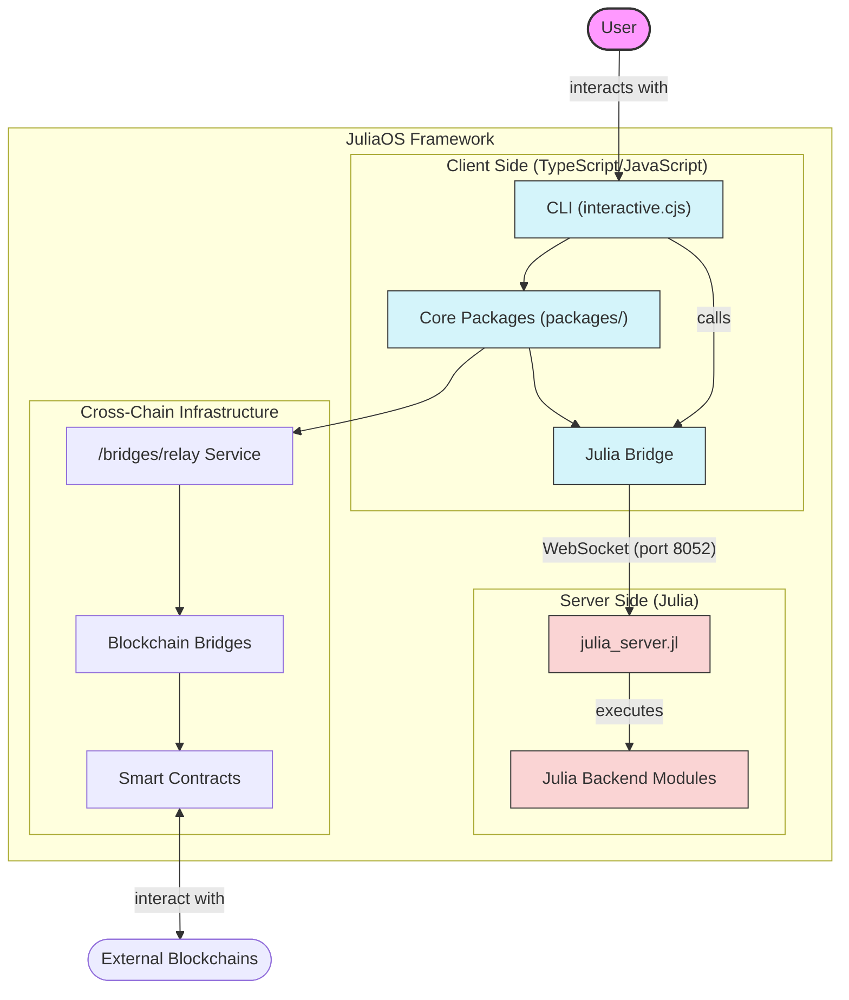

# JuliaOS Open Source AI Agent & Swarm Framework

*joo-LEE-uh-oh-ESS* /ˈdʒuː.li.ə.oʊ.ɛs/  

**Noun**  
**A powerful multi-chain, community driven, 3 in 1, Web3 focused project aiming at AI and Swarm technological Innovation, powered by Julia.**  


## Overview

JuliaOS is a comprehensive framework for building decentralized applications (DApps) with a focus on agent-based architectures, swarm intelligence, and cross-chain trading. It provides both a CLI interface for quick deployment and a framework API for custom implementations. By leveraging AI-powered agents and swarm optimization, JuliaOS enables sophisticated trading strategies across multiple blockchains.

## Features

### Core Features
- ⚡ Agent-based architecture
- 🧬 Swarm intelligence capabilities
- ⛓️ Full multi-chain support with bridges connecting Solana, Ethereum, Polygon, Arbitrum, Base and other major chains
- 📡 Advanced trading capabilities
- 🔐 Built-in security features
- 📊 Performance monitoring
- 🖥️ Extensive CLI tools
- 📘 Comprehensive documentation
- 🌐 Multi-wallet support (MetaMask, Phantom, Rabby)
- 🛰️ Chainlink price feeds integration
- 🌉 AI-optimized cross-chain bridging
- ⚙️ Production-ready for testnet use; mainnet deployment with standard security precautions recommended
- 🗄️ Modular Julia framework with dedicated components

### Trading Components
- **Market Data Service**: Real-time price and liquidity tracking across chains
- **Position Management**: Cross-chain position tracking and management
- **Risk Management**: Chain-specific and cross-chain risk controls
- **Execution System**: Optimized execution across multiple DEXes
- **Monitoring System**: Comprehensive cross-chain analytics
- **Bridge Router**: AI-optimized asset routing between chains

### Security Components
- **SecurityManager**: Core security infrastructure with emergency response capabilities
- **Cross-Chain Security**: Bridge authentication and encrypted communications
- **Risk Assessment**: Real-time transaction and smart contract risk evaluation
- **Anomaly Detection**: ML-powered monitoring for suspicious activity
- **Emergency Response**: Automated incident response and circuit breakers
- **User-Extensible Security**: Custom security modules via the UserModules system

### Agent System
- **Solana-First Strategy**: Prioritized execution on Solana
- **Multiple Trading Strategies**: Choose your own
- **Cross-Chain Arbitrage**: Opportunities across chains
- **Julia-Powered Agents**: High-performance agent system implemented in Julia

### Swarm Intelligence
- **Multiple Algorithms**: PSO (Particle Swarm Optimization), GWO (Grey Wolf Optimizer), ACO (Ant Colony Optimization), GA (Genetic Algorithm), WOA (Whale Optimization Algorithm), DE (Differential Evolution) 
- **Dynamic Coordination**: Real-time agent coordination using swarm intelligence
- **Adaptable Parameters**: Configurable swarm parameters for different market conditions
- **Visualization Tools**: Swarm behavior and performance tracking

### Wallet Integrations
- **Browser Wallets**: MetaMask, Phantom, Rabby
- **Key Management**: Secure private key storage and encryption
- **Multi-Chain Support**: Single interface for all supported chains
- **CLI Configuration**: Easy wallet setup via CLI

### Price Feed Integrations
- **Chainlink Oracles**: Primary source for accurate price data
- **On-chain DEX Prices**: Backup price sources from major DEXes
- **Aggregated Pricing**: Confidence-weighted data from multiple sources
- **Configurable Sources**: Customizable price feed priorities

### CLI Features
- **Cross-Chain Support**: Trade across multiple blockchain networks
- **AI-Powered Agents**: Intelligent trading agents with customizable strategies
- **Swarm Intelligence**: Coordinated trading through agent swarms
- **Wallet Integration**: Support for multiple wallet types
- **Security**: Built-in security measures and best practices
- **Monitoring**: Comprehensive monitoring and logging capabilities
- **Interactive Mode**: Enhanced CLI with interactive menus and visualizations

### Trading Strategies
- **Arbitrage**: Cross-chain price arbitrage
- **Market Making**: Automated market making
- **Yield Farming**: Optimized yield farming across chains
- **Custom Strategies**: Extensible strategy framework

### Technical Features
- **TypeScript/Node.js**: Modern, type-safe implementation
- **Julia Integration**: High-performance trading logic
- **Prometheus Metrics**: Detailed performance monitoring
- **Elasticsearch Logging**: Advanced log aggregation
- **Health Checks**: System and network monitoring
- **Alert System**: Customizable alerts and notifications

## Security and GitHub Preparation

Before pushing changes to GitHub or any public repository, ensure all sensitive information is properly secured:

### Security Checklist

1. **Environment Variables**: 
   - Never commit `.env` files containing real API keys or private keys
   - Use `.env.example` files with placeholder values instead
   - Check that all `.env` files are properly listed in `.gitignore`

2. **Wallet Data**: 
   - All wallet files (JSON, keystore, etc.) should be excluded via `.gitignore`
   - Verify no private keys or mnemonics are hardcoded in any files

3. **API Keys**: 
   - Remove any hardcoded API keys from the codebase
   - Use environment variables or secure key management solutions

4. **Test Data**: 
   - Sanitize test data to remove any sensitive information
   - Use mock data for tests rather than real account information

5. **Before Commits**:
   - Run `git status` to check which files will be committed
   - Review changes with `git diff` to ensure no secrets are included
   - Consider using a pre-commit hook to scan for sensitive information

### Handling Secrets

For local development, secrets should be managed securely:

```bash
# Copy the example environment file
cp .env.example .env

# Edit the file with your actual credentials
nano .env  # or use any text editor
```

The `.gitignore` file is configured to exclude sensitive files including:
- `.env` files in all directories
- Wallet data in `data/wallets/`
- Secret keys in `data/secrets/`
- Any files matching patterns like `*wallet*.json`, `*key*`, etc.

## Quick Start

### Prerequisites

Before you begin, ensure you have ONE of the following options:

#### Option 1: Node.js (Direct Execution)
- [Node.js](https://nodejs.org/) (v16 or later)
- [npm](https://www.npmjs.com/) (v7 or later)

#### Option 2: Docker (Containerized Execution)
- [Docker](https://www.docker.com/get-started) installed and running

### API Keys Setup (Optional)

For enhanced functionality, you can set up API keys:

1. Copy the example .env file:
```bash
cp cli/.env.example cli/.env
```

2. Edit the `.env` file and add your API keys:
- OpenAI API key for GPT models
- Anthropic API key for Claude models
- Blockchain provider RPC URLs
- Exchange API keys (if needed)

Without API keys, the CLI will still function but will use simulated responses instead of real AI services.

### CLI Installation

The JuliaOS CLI provides a command-line interface for creating and managing AI-powered trading agents and swarms.

#### Using the Interactive CLI

Our interactive CLI is the recommended way to interact with JuliaOS, providing a user-friendly interface with menus and visualizations:

```bash
# Clone this repository
git clone https://github.com/Juliaoscode/JuliaOS.git
cd JuliaOS

# Start the Julia server (in a separate terminal)
cd julia
./start.sh

# Run the interactive CLI
node scripts/interactive.cjs
```

You can also use the script with various options:

```bash
# Run interactive CLI with existing server
node scripts/interactive_use_existing.cjs

# Run interactive CLI with custom config
node scripts/interactive.cjs --config ./my-config.json
```

### Example: Creating and Running a Simple Agent

```bash
# 1. Start the Julia server in one terminal
cd julia
./start.sh

# 2. Run the interactive CLI in another terminal
node scripts/interactive.cjs

# 3. From the interactive menu:
# - Select "Agent Management"
# - Select "Create AI Agent"
# - Follow the prompts to configure your agent
# - Once created, you can start it from the same menu
```

For more detailed examples and use cases, refer to the examples in each package's documentation.

## Architecture Overview



**Architecture Notes:** The JuliaOS framework follows a client-server architecture. The Julia backend runs as a WebSocket/HTTP server on port 8052 (julia_server.jl), while TypeScript/JavaScript clients connect to this server via WebSocket. The interactive CLI (scripts/interactive.cjs) serves as the primary user interface, communicating with the Julia backend through the Julia Bridge package. All computational intelligence is performed server-side in the Julia modules, with results returned to the clients.

## Architecture

JuliaOS follows a client-server architecture with the following key components:

```
Root Directory
├── julia/                 # Core Julia backend server
│   ├── src/               # Julia source code
│   │   ├── JuliaOS.jl     # Main Julia module
│   │   ├── AgentSystem.jl # Agent system implementation
│   │   ├── SwarmManager.jl # Swarm management functionality
│   │   └── ...            # Other Julia components
│   ├── julia_server.jl    # WebSocket/HTTP server (port 8052)
│   ├── apps/              # Application-specific Julia code
│   ├── examples/          # Example Julia implementations
│   ├── test/              # Julia tests
│   ├── use_cases/         # Example use cases
│   └── start.sh           # Script to start the Julia server
│
├── packages/              # TypeScript/JavaScript packages (monorepo)
│   ├── framework/         # Julia-based framework modules
│   │   ├── agents/        # Agent system interfaces for Julia backend
│   │   ├── swarms/        # Swarm intelligence algorithm interfaces
│   │   ├── blockchain/    # Blockchain interaction interfaces
│   │   ├── bridge/        # Communication bridge interfaces
│   │   ├── wallet/        # Wallet management interfaces
│   │   └── utils/         # Utility functions
│   ├── julia-bridge/      # WebSocket bridge to Julia backend
│   ├── cli/               # Command-line interface
│   ├── core/              # Framework core functionality
│   ├── wallets/           # Wallet integrations (MetaMask, Phantom, Rabby)
│   ├── agent-manager/     # High-level agent management
│   ├── cross-chain-router/# Cross-chain routing functionality
│   ├── protocols/         # Blockchain protocol implementations
│   └── ...                # Other TypeScript packages
│
├── scripts/               # Utility scripts
│   ├── interactive.cjs    # Main interactive CLI (connects to Julia server)
│   └── ...                # Other scripts
│
├── bridges/               # Cross-chain bridge implementations
└── contracts/             # Smart contract implementations
```

### Key Architecture Points

1. **Client-Server Model**: The system follows a client-server architecture:
   - **Server**: Julia backend running as a WebSocket server on port 8052
   - **Client**: TypeScript/JavaScript frontend and CLI that connect to the server

2. **Julia Backend (`/julia`)**: 
   - Serves as the computational engine for the entire system
   - Handles agent creation, management, and coordination
   - Performs cross-chain operations and route optimization
   - Manages swarm intelligence algorithms
   - Exposes functionality via WebSocket/HTTP interface

3. **TypeScript Frontend (`/packages`)**: 
   - Provides user interfaces and abstractions
   - Communicates with the Julia backend via WebSocket
   - Includes a CLI for user interactions
   - Manages wallet connections and blockchain interactions

4. **Framework Structure**:
   - `/packages/framework/` provides Julia-based modules that interface with the Julia backend
   - `/packages/julia-bridge/` handles communication between TypeScript and Julia
   - Other packages build on these foundations to provide specific functionality

5. **Communication Flow**:
   ```
   User → interactive.cjs → julia-bridge → julia/julia_server.jl → Julia Backend Modules
   ```

For a detailed architecture overview, see the README files in each package:
- [Framework README](./packages/framework/README.md)
- [Julia Bridge README](./packages/julia-bridge/README.md)
- [Core README](./packages/core/README.md)

For more examples, see the README files in each module:
- [Agents Module](./packages/framework/agents/README.md)
- [Swarms Module](./packages/framework/swarms/README.md)
- [Blockchain Module](./packages/framework/blockchain/README.md)
- [Wallet Module](./packages/framework/wallet/README.md)
- [Bridge Module](./packages/framework/bridge/README.md)
- [Utils Module](./packages/framework/utils/README.md)

## Framework Components

### Core Framework

The core framework provides the foundation for building agents, implementing swarm intelligence, and interacting with blockchains:

```typescript
import { BaseAgent, SwarmAgent, Skill } from '@juliaos/core';
import { JuliaBridge } from '@juliaos/julia-bridge';

// Create an agent with swarm capabilities
const agent = new SwarmAgent({
  name: 'DeFiTradingAgent',
  type: 'trading',
  swarmConfig: {
    size: 30,
    communicationProtocol: 'gossip',
    consensusThreshold: 0.7,
    updateInterval: 5000
  }
});

// Initialize and start the agent
await agent.initialize();
await agent.start();
```

For more examples, see the [Core Framework Documentation](./packages/core/README.md).

### Julia Framework

The Julia-based framework provides high-performance modules for AI agents, swarm algorithms, blockchain integration, and more:

```julia
using JuliaOS.Agents
using JuliaOS.Swarms
using JuliaOS.Blockchain

# Create a trading agent
agent = Agent(
    name = "TradingAgent",
    skills = ["market_analysis", "trade_execution"],
    config = Dict(
        "max_position_size" => 1000,
        "risk_tolerance" => "medium"
    )
)

# Create a swarm with Particle Swarm Optimization
swarm = Swarm(
    name = "TradingSwarm",
    algorithm = "PSO",
    agents = [agent],
    parameters = Dict(
        "swarm_size" => 30,
        "inertia_weight" => 0.7,
        "cognitive_coefficient" => 1.5,
        "social_coefficient" => 1.5
    )
)

# Start the swarm
start!(swarm)

# Connect to Ethereum network
ethereum = connect(
    network = "ethereum",
    endpoint = "https://mainnet.infura.io/v3/YOUR_API_KEY"
)

# Check balance
balance = getBalance("0x123...", ethereum)
println("ETH Balance: $balance")
```

The Julia framework consists of the following modules:

1. **Agents Module**: Create, manage, and deploy AI agents with various capabilities.
2. **Swarms Module**: Implement swarm intelligence algorithms for coordinated agent behavior.
3. **Bridge Module**: Facilitate communication between Julia and client applications.
4. **Wallet Module**: Manage blockchain wallet connections and operations.
5. **Blockchain Module**: Interact with various blockchain networks and smart contracts.
6. **Utils Module**: Common utilities for formatting, encoding/decoding, and more.

For more on the Julia framework, see [Julia Framework Documentation](./packages/framework/README.md).

### Julia Integration

JuliaOS uses Julia for high-performance computing tasks, such as swarm optimization algorithms:

```typescript
import { JuliaBridge } from '@juliaos/julia-bridge';

// Create and initialize the bridge
const bridge = new JuliaBridge();
await bridge.initialize();

// Create a swarm for optimization
const swarmId = await bridge.createSwarm({
  size: 30,
  algorithm: 'pso',
  parameters: {
    maxPositionSize: 1000,
    stopLoss: 0.05,
    takeProfit: 0.1
  }
});

// Run optimization
const result = await bridge.optimizeSwarm(swarmId, marketData);
```

For more on Julia integration, see:
- [Julia Bridge Documentation](./packages/julia-bridge/README.md)
- [Julia Swarm Documentation](./packages/framework/swarms/README.md)

### Cross-Chain Bridge System

The cross-chain bridge system provides optimized routing for asset transfers between supported blockchains:

```typescript
import { BridgeManager, RouteOptimizer } from '@juliaos/bridges';

// Create a bridge manager instance
const bridgeManager = new BridgeManager({
  supportedChains: ['ethereum', 'polygon', 'solana', 'arbitrum', 'base'],
  providers: ['wormhole', 'stargate', 'hop', 'connext'],
  defaultStrategy: 'balanced'
});

// Calculate the optimal route
const optimalRoute = await bridgeManager.calculateRoute({
  source: 'ethereum',
  destination: 'polygon',
  token: 'USDC',
  amount: '100',
  strategy: 'lowest_fee' // 'lowest_fee', 'fastest', 'most_secure', 'balanced'
});

// Execute the bridge transaction
const result = await bridgeManager.executeBridge(optimalRoute, wallet);
console.log(`Bridge transaction completed: ${result.transactionHash}`);
```

The framework's bridge system leverages Julia's optimization algorithms to find the most efficient path for your assets based on your preferences (lowest fee, fastest, most secure, or balanced). The bridge router supports complex multi-hop routes across different networks for optimal efficiency.

## Development Guide

### Project Setup

1. Clone the repository:
```bash
git clone https://github.com/Juliaoscode/JuliaOS.git
cd JuliaOS
```

2. Install dependencies:
```bash
npm install
```

3. Build all packages:
```bash
npm run build
```

### Development Workflow

1. Make changes to the relevant packages
2. Build the affected packages:
```bash
npm run build --filter=@juliaos/core
```

3. Run tests:
```bash
npm test
```

### Common Issues

- **TypeScript Errors**: Ensure you have the correct TypeScript version installed.
- **Julia Integration**: Make sure Julia is installed and accessible in your PATH.
- **Package Dependencies**: If using unpublished packages, use workspace references in `package.json`.

### Testing Security

To help ensure security when pushing to public repositories, this project includes helper scripts:

```bash
# On Windows
scripts\clean-sensitive-files.bat

# On Mac/Linux
chmod +x scripts/clean-sensitive-files.sh
scripts/clean-sensitive-files.sh
```

These scripts remove sensitive files from git tracking without deleting them from your workspace.

## Security

For security best practices and vulnerability reporting, please see [SECURITY.md](./SECURITY.md).

## Contributing

We welcome contributions from the community! Please see [CONTRIBUTING.md](./CONTRIBUTING.md) for guidelines.

## License

This project is licensed under the MIT License - see the [LICENSE](./LICENSE) file for details.

## Support

- Documentation (Coming Soon)
- GitHub Issues (Coming Soon)
- Email Support (Coming Soon)

## Project Structure

```
my-trading-project/
├── src/
│   ├── agents/           # Trading agents
│   ├── strategies/       # Trading strategies
│   ├── networks/         # Network configurations
│   └── utils/           # Utility functions
├── config/
│   ├── agents.json      # Agent configurations
│   ├── networks.json    # Network settings
│   └── strategies.json  # Strategy parameters
├── logs/                # Application logs
├── tests/              # Test files
└── package.json        # Project dependencies
```