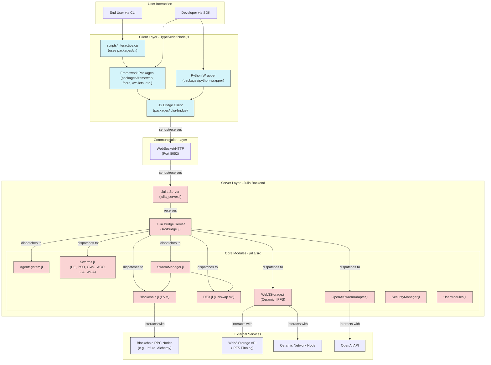

# JuliaOS Open Source AI Agent & Swarm Framework

*joo-LEE-uh-oh-ESS* /ˈdʒuː.li.ə.oʊ.ɛs/

**Noun**
**A powerful multi-chain, community-driven framework for AI and Swarm technological innovation, powered by Julia.**


## Overview

JuliaOS is a comprehensive framework for building decentralized applications (DApps) with a focus on agent-based architectures, swarm intelligence, and cross-chain operations. It provides both a CLI interface for quick deployment and a framework API for custom implementations. By leveraging AI-powered agents and swarm optimization, JuliaOS enables sophisticated strategies across multiple blockchains.

The system features real implementations of agents, swarms, blockchain interactions, DEX operations, storage, and cross-chain bridges. It has a modular architecture that allows for easy extension and integration with existing components. The Julia backend provides high-performance computation, while the TypeScript/JavaScript frontend offers a user-friendly interface. The Python wrapper provides a comprehensive interface to JuliaOS with support for LangChain, multiple LLM providers, and Google ADK.

## Features

### Core Features
- ⚡ Agent-based architecture with real implementations for different agent types
- 🧬 Swarm intelligence with multiple optimization algorithms (DE, PSO, ACO, GA, GWO, WOA, DEPSO)
- 🧠 Agent Skills & Specialization system with experience tracking and level progression
- 🤖 Neural Networks integration with Flux.jl for various network architectures
- 💼 Portfolio Optimization with dynamic rebalancing using swarm intelligence
- 🧮 Hybrid Swarm Algorithms with multi-objective optimization and constraint handling
- ⛓️ Multi-chain support (Ethereum, Polygon, Solana, Arbitrum, Optimism, Avalanche, BSC) with real blockchain interactions
- 📡 DEX functionality with price quotes, slippage protection, and multi-chain support
- 🌉 Cross-chain bridge integration with Wormhole, Axelar, and LayerZero for token transfers
- 💾 Decentralized storage with Arweave, IPFS, and local SQLite storage
- 🔐 Comprehensive security infrastructure with input validation and error handling
- 📊 Enhanced monitoring and logging across all modules
- 🖥️ Interactive CLI with improved usability and error handling
- 📘 Comprehensive project documentation with API references and examples
- 🌐 Wallet integration with support for multiple providers (MetaMask, WalletConnect, Ledger)
- 🔗 LangChain integration in the Python wrapper
- 🐍 Python Wrapper with comprehensive interface to JuliaOS
- 🤖 Multiple LLM integrations (OpenAI, Anthropic/Claude, Llama, Mistral, Cohere, Gemini)
- 🧩 Google Agent Development Kit (ADK) integration
- 📈 Chainlink price feed integration for reliable on-chain data
- ⚙️ Usable on testnets with improved reliability and error handling
- 🗄️ Modular architecture with clear separation of concerns
- 🐳 Docker support for easy deployment and cross-platform compatibility

### Trading Components
- **DEX Interaction**: Multi-chain DEX support with price quotes, slippage protection, and transaction execution. Support for multiple DEXes (Uniswap V2/V3, SushiSwap, PancakeSwap, QuickSwap, TraderJoe, Raydium) across different chains with real-time price data.
- **Swarm Management**: Advanced swarm coordination with multiple optimization algorithms, constraint handling, and adaptive parameter tuning. Support for multi-objective optimization and specific trading strategies with real-time parameter adaptation.
- **Blockchain Interface**: Multi-chain support (Ethereum, Polygon, Solana, Arbitrum, Optimism, Avalanche, BSC, Base) with balance checks, transaction creation and sending, gas estimation, and chain ID retrieval. Integration with existing wallet implementations and EIP-1559 support.
- **Cross-Chain Hub**: Comprehensive bridge integration (Wormhole, LayerZero, Axelar, Synapse, Across, Hop Protocol, Stargate Protocol) for cross-chain token transfers with transaction status tracking, wrapped asset information, and transaction history. Supports multiple networks (Ethereum, Solana, Polygon, BSC, Avalanche, Arbitrum, Optimism, Fantom, Moonbeam, Celo, Kava, Filecoin, Base, zkSync, Linea, Mantle, Gnosis Chain, Metis) with real token transfers. Features include bridge transaction management, cross-chain asset tracking, bridge settings configuration, and detailed transaction history. See [Cross-Chain Hub Documentation](./docs/gitbook/technical/features/bridges.md) for more details.
- **Market Data Service**: Real-time price and liquidity tracking with Chainlink integration for reliable price feeds. Support for multiple data sources with fallback mechanisms and aggregation strategies.
- **Position Management**: Cross-chain position tracking with persistent storage and real-time updates. Support for position sizing, entry/exit strategies, and profit/loss tracking.
- **Risk Management**: Chain-specific and cross-chain risk controls with configurable parameters. Includes position sizing, stop-loss mechanisms, and exposure limits with real-time monitoring.
- **Monitoring System**: Comprehensive cross-chain analytics with detailed logging and visualization. Includes performance metrics, trade history, and risk exposure dashboards.

### Security Components
- **Input Validation**: Comprehensive input validation across all modules to prevent injection attacks and ensure data integrity.
- **Error Handling**: Robust error handling with detailed error messages and graceful failure recovery.
- **Authentication**: Support for API keys and token-based authentication for secure access to the system.
- **Authorization**: Role-based access control for different operations and resources.
- **Secure Storage**: Encrypted storage of sensitive information with secure key management.
- **Rate Limiting**: Protection against abuse with configurable rate limits for API endpoints.
- **Logging**: Detailed logging of security events for audit and troubleshooting.
- **User-Extensible Security**: Customizable security policies and rules via configuration.

### Agent System
- **Agent Creation and Management**: Comprehensive agent creation, management, and specialization with support for different agent types.
- **Agent Types**: Support for various agent types including trading, arbitrage, liquidity, monitoring, and data agents.
- **Agent Configuration**: Flexible agent configuration with customizable parameters and behaviors.
- **Agent Storage**: Persistent storage of agent configurations and states with both local and decentralized options.
- **Agent Communication**: Inter-agent communication for collaborative problem-solving and information sharing.
- **Agent Monitoring**: Real-time monitoring of agent activities and performance metrics.
- **Agent Deployment**: Easy deployment of agents across different environments and blockchain networks.
- **Agent Specialization**: Specialized agents for specific tasks and domains with optimized performance.

### Swarm Intelligence
- **Multiple Algorithms**: Real implementations of DE, PSO, GWO, ACO, GA, WOA, DEPSO algorithms with comprehensive configuration options.
- **Hybrid Algorithms**: Advanced hybrid algorithms (including DEPSO) combining multiple optimization techniques for improved performance and robustness.
- **Multi-Objective Optimization**: Support for multi-objective optimization with Pareto front generation and solution selection using NSGA-II, weighted sum, and epsilon-constraint methods.
- **Constraint Handling**: Sophisticated constraint handling mechanisms for real-world optimization problems with complex constraints using penalty functions and feasibility rules.
- **Adaptive Parameter Tuning**: Dynamic adjustment of algorithm parameters based on optimization progress and problem characteristics with convergence-based adaptation.
- **Parallel Processing**: Efficient parallel evaluation of population members for significantly improved performance.
- **SIMD Optimizations**: Low-level optimizations using Single Instruction, Multiple Data operations for vector calculations.
- **Visualization Tools**: Real-time visualization of optimization progress and solution quality.
- **Benchmark Suite**: Comprehensive benchmark problems for algorithm comparison and performance evaluation.
- **Custom Objective Functions**: Support for user-defined objective functions with complex evaluation logic.
- **CLI Integration**: Seamless integration with the JuliaOS CLI for easy management of swarms and optimization tasks.
- **Performance Optimization**: Tools for profiling and optimizing swarm algorithms with adaptive parameters and caching.
- **Fault Tolerance**: Mechanisms for handling agent failures and ensuring swarm resilience with checkpointing and recovery.
- **Security Features**: Authentication, authorization, and encryption for secure swarm communication.
- **Swarm Coordination**: Advanced coordination mechanisms for multi-agent swarms with leader election and task allocation.

### Agent Skills & Specialization
- **Skill System**: Advanced skill system with experience tracking, level progression, and skill dependencies.
- **Specialization Paths**: Multiple specialization paths for different agent roles with unique abilities and bonuses. Includes paths for Analyst, Trader, Researcher, Optimizer, Predictor, Risk manager, Security expert, and Generalist roles.
- **Performance Bonuses**: Dynamic performance bonuses based on skill levels, specialization, and task complexity.
- **Training System**: Comprehensive skill training with different intensity levels and learning curves.
- **Skill Transfer**: Ability to transfer skills between agents with efficiency modifiers.
- **Skill Decay**: Realistic skill decay when skills are not used regularly.
- **Skill Synergies**: Bonus effects when complementary skills are combined.
- **Specialization Trees**: Hierarchical specialization trees with prerequisites and advanced abilities.
- **Skill Challenges**: Special challenges to test and improve specific skills.
- **Skill Analytics**: Detailed analytics on skill usage, effectiveness, and improvement opportunities.
- **View Specialization Paths**: Direct menu option to view available specialization paths for agents.

### Neural Networks
- **Flux.jl Integration**: Seamless integration with Flux.jl for state-of-the-art neural network capabilities with optimized performance.
- **Multiple Architectures**: Support for a wide range of network architectures including feed-forward, recurrent (LSTM, GRU, RNN), convolutional, and transformer networks.
- **Bidirectional Networks**: Support for bidirectional recurrent networks for improved sequence modeling.
- **Model Management**: Comprehensive model training, validation, saving, and loading capabilities with version control and early stopping.
- **Agent-Specific Networks**: Specialized neural network management for individual agents with personalized configurations and model sharing.
- **Transfer Learning**: Ability to use pre-trained models and fine-tune them for specific tasks with layer freezing.
- **Distributed Training**: Support for distributed training across multiple machines for large models with data parallelism.
- **Hyperparameter Optimization**: Automated hyperparameter tuning using swarm intelligence algorithms (DE, PSO, DEPSO).
- **Model Visualization**: Tools for visualizing network architecture, training progress, and activation patterns with interactive dashboards.
- **Ensemble Methods**: Support for ensemble learning with multiple neural networks for improved performance and robustness.

### Portfolio Optimization
- **Dynamic Rebalancing**: Advanced portfolio rebalancing system with multiple strategies and timing algorithms.
- **Swarm Optimization**: Sophisticated portfolio optimization using various swarm intelligence algorithms for different market conditions.
- **Constraint Handling**: Comprehensive implementation of realistic portfolio constraints including transaction costs, liquidity, and position limits.
- **Multi-Asset Support**: Support for diverse asset classes including cryptocurrencies, tokens, NFTs, and traditional assets.
- **Risk Management**: Advanced risk management with various risk metrics (VaR, CVaR, drawdown) and risk-adjusted return optimization.
- **Factor Models**: Implementation of factor models for risk decomposition and attribution analysis.
- **Scenario Analysis**: Tools for stress testing portfolios under different market scenarios.
- **Tax Optimization**: Strategies for tax-efficient portfolio management and harvesting.
- **Multi-Period Optimization**: Support for multi-period optimization with dynamic asset allocation.
- **Visualization Tools**: Comprehensive tools for portfolio analysis, performance attribution, and interactive visualization.

### Wallet Integrations
- **Multi-Chain Support**: Comprehensive wallet support for multiple blockchain networks including Ethereum, Polygon, and Solana.
- **Multiple Providers**: Integration with various wallet providers including MetaMask, Phantom, and Rabby.
- **Private Key Management**: Secure private key management with encryption and key derivation.
- **Hardware Wallet Support**: Integration with hardware wallets for enhanced security.
- **Transaction Signing**: Robust transaction signing with support for different transaction types and formats.
- **Balance Tracking**: Real-time balance tracking across multiple chains and tokens.
- **Address Management**: Management of multiple addresses with labeling and organization features.
- **Transaction History**: Comprehensive transaction history with filtering and search capabilities.
- **Gas Estimation**: Accurate gas estimation for EVM transactions with fee optimization.
- **Nonce Management**: Automatic nonce management to prevent transaction failures.

### LLM Integrations
- **OpenAI**: Comprehensive integration with OpenAI models (GPT-3.5, GPT-4) with streaming support and advanced parameter configuration.
- **Anthropic/Claude**: Full support for Claude 3 models (Opus, Sonnet, Haiku) with context window optimization and response formatting.
- **Llama**: Integration with Llama models via Replicate API with fine-tuning capabilities and model selection.
- **Mistral**: Support for Mistral AI models with parameter optimization and response streaming.
- **Cohere**: Integration with Cohere models for specialized tasks with custom embeddings and classification.
- **Gemini**: Support for Google's Gemini models with multimodal capabilities and advanced prompting.
- **Model Switching**: Intelligent model selection based on task requirements and performance metrics.
- **Prompt Management**: Advanced prompt management with templates, variables, and version control.
- **Response Processing**: Sophisticated response processing with parsing, validation, and transformation.
- **Cost Optimization**: Strategies for optimizing LLM usage costs while maintaining quality.

### Google ADK Integration
- **ADK Adapter**: Comprehensive adapter classes for seamless integration between JuliaOS and Google ADK.
- **ADK-Compatible Interfaces**: Full implementation of ADK-compatible interfaces for all JuliaOS components.
- **Tool Integration**: Complete conversion of JuliaOS capabilities to ADK tools with parameter mapping and result handling.
- **Memory Integration**: Sophisticated integration with ADK memory system for persistent state management.
- **Function Calling**: Support for ADK function calling with parameter validation and error handling.
- **Multi-Agent Collaboration**: Integration with ADK's multi-agent collaboration features.
- **Retrieval Augmentation**: Support for ADK's retrieval augmentation capabilities with JuliaOS data sources.
- **Tool Chaining**: Implementation of tool chaining for complex workflows across JuliaOS and ADK.
- **Conversation Management**: Integration with ADK's conversation management for stateful interactions.
- **Metrics and Logging**: Comprehensive metrics and logging for ADK integration performance monitoring.

### Price Feed Integrations
- **On-chain DEX Prices**: Real-time price data from on-chain DEXes with liquidity-weighted averaging.
- **Chainlink Integration**: Comprehensive integration with Chainlink price feeds for reliable and accurate price data.
- **Aggregated Pricing**: Sophisticated price aggregation from multiple sources with outlier detection and weighted averaging.
- **Configurable Sources**: Flexible configuration of price sources with priority settings and fallback mechanisms.
- **Historical Data**: Access to historical price data with various time intervals and aggregation methods.
- **Price Alerts**: Configurable price alerts with notification mechanisms and trigger conditions.
- **Custom Oracles**: Support for custom price oracles with validation and verification.
- **Cross-Chain Pricing**: Consistent price data across multiple blockchain networks with normalization.
- **Price Impact Calculation**: Accurate calculation of price impact for large trades with slippage estimation.
- **Price Feed Monitoring**: Continuous monitoring of price feeds for reliability and accuracy.

### CLI Features
- **Multi-Chain Support**: Comprehensive interaction with multiple blockchain networks including Ethereum, Polygon, and Solana.
- **Agent/Swarm Management**: Advanced creation, configuration, and management of agents and swarms via interactive CLI.
- **Agent Skills & Specialization**: View and manage agent skills and specialization paths directly from the CLI.
- **AI Integration**: Seamless integration with multiple LLM providers including OpenAI, Claude, Llama, Mistral, Cohere, and Gemini.
- **Wallet Integration**: Robust wallet management with support for multiple providers and secure key handling.
- **Interactive Mode**: Enhanced menu-driven interface with improved navigation and context-aware commands.
- **Command History**: Persistent command history with search and filtering capabilities.
- **Batch Processing**: Support for batch operations and scripting for automated workflows.
- **Output Formatting**: Flexible output formatting with support for various formats (JSON, table, tree).
- **Error Handling**: Comprehensive error handling with detailed error messages and recovery suggestions.
- **Configuration Management**: Advanced configuration management with profiles and environment-specific settings.

### Technical Features
- **TypeScript/Node.js**: Modern frontend CLI and framework wrappers with TypeScript type safety and Node.js performance.
- **Julia Integration**: High-performance backend logic with optimized algorithms and parallel processing capabilities.
- **Python Wrapper**: Comprehensive Python interface with LangChain, LLM, and ADK integrations for AI applications.
- **Decentralized Storage**: Multi-provider storage support including Arweave for permanent decentralized storage and local SQLite for efficient local storage.
- **LangChain Integration**: Full LangChain integration with custom agents, tools, memory, chains, and retrievers.
- **Modular Architecture**: Clean separation of concerns with modular design for easy extension and maintenance.
- **API Documentation**: Comprehensive API documentation with examples and usage guidelines.
- **Health Monitoring**: Detailed health checks and status reporting across all components.
- **Metrics Collection**: Prometheus-compatible metrics for performance monitoring and optimization.
- **Structured Logging**: Consistent logging format with severity levels and contextual information.

## Documentation

Comprehensive documentation for JuliaOS is available in the `/docs/gitbook` folder. Here are some key documents to get you started:

### Technical Documentation

- [Features](./docs/gitbook/technical/features/README.md): Core features and concepts
  - [Agents](./docs/gitbook/technical/features/agents.md): Agent system and types
  - [Swarms](./docs/gitbook/technical/features/swarms.md): Swarm algorithms and optimization
  - [Chains](./docs/gitbook/technical/features/chains.md): Supported blockchain networks
  - [Wallets](./docs/gitbook/technical/features/wallets.md): Wallet management and integration
  - [Bridges](./docs/gitbook/technical/features/bridges.md): Cross-chain bridge functionality
  - [DEX Integration](./docs/gitbook/technical/features/dex.md): Decentralized exchange support
  - [Storage](./docs/gitbook/technical/features/storage.md): Local and decentralized storage options
  - [Trading](./docs/gitbook/technical/features/trading.md): Trading capabilities and strategies
  - [Use Cases](./docs/gitbook/technical/features/use-cases.md): Example applications and use cases

- [Architecture](./docs/gitbook/technical/architecture/README.md): System architecture and design
  - [System Overview](./docs/gitbook/technical/architecture/system-overview.md): High-level architecture
  - [Component Interactions](./docs/gitbook/technical/architecture/component-interactions.md): How components work together
  - [Data Flow](./docs/gitbook/technical/architecture/data-flow.md): How data flows through the system

### Developer Hub

- [Setup](./docs/gitbook/technical/developer-hub/setup.md): Development environment setup
- [CLI](./docs/gitbook/technical/developer-hub/cli/README.md): Command-line interface documentation
- [Framework](./docs/gitbook/technical/developer-hub/framework/README.md): Framework usage and API
- [Python Wrapper](./docs/gitbook/technical/developer-hub/framework/python-wrapper/README.md): Using JuliaOS from Python
- [Extending](./docs/gitbook/technical/developer-hub/extending.md): Adding new functionality
- [Best Practices](./docs/gitbook/technical/developer-hub/best-practices/README.md): Development guidelines
- [Testing & Debugging](./docs/gitbook/technical/developer-hub/testing-debugging.md): Testing and troubleshooting
- [Contributing](./docs/gitbook/technical/developer-hub/contributing.md): How to contribute

### API Reference

- [Julia API](./docs/gitbook/technical/api/julia.md): Julia backend API reference
- [TypeScript API](./docs/gitbook/technical/api/typescript.md): TypeScript framework API reference
- [Python API](./docs/gitbook/technical/api/python.md): Python wrapper API reference

### Tutorials and Examples

- [Tutorials](./docs/gitbook/technical/tutorials/README.md): Step-by-step guides
- [Examples](./docs/gitbook/technical/examples/README.md): Example projects and code snippets

For a complete list of documentation, see the [Documentation Index](./docs/gitbook/README.md).

## Security and GitHub Preparation

Before pushing changes to GitHub or any public repository, ensure all sensitive information is properly secured:

### Security Checklist

1. **Environment Variables**:
   - Never commit `.env` files containing real API keys or private keys
   - Use `.env.example` files with placeholder values instead
   - Check that all `.env` files are properly listed in `.gitignore`

2. **Wallet Data**:
   - All wallet files (JSON, keystore, etc.) should be excluded via `.gitignore`
   - Verify no private keys or mnemonics are hardcoded in any files

3. **API Keys**:
   - Remove any hardcoded API keys from the codebase
   - Use environment variables or secure key management solutions

4. **Test Data**:
   - Sanitize test data to remove any sensitive information
   - Use mock data for tests rather than real account information

5. **Before Commits**:
   - Run `git status` to check which files will be committed
   - Review changes with `git diff` to ensure no secrets are included
   - Consider using a pre-commit hook to scan for sensitive information

### Handling Secrets

For local development, secrets should be managed securely:

```bash
# Copy the example environment file
cp .env.example .env

# Edit the file with your actual credentials
nano .env  # or use any text editor
```

The `.gitignore` file is configured to exclude sensitive files including:
- `.env` files in all directories
- Wallet data in `data/wallets/`
- Secret keys in `data/secrets/`
- Any files matching patterns like `*wallet*.json`, `*key*`, etc.

## Quick Start

### Prerequisites

#### Option 1: Using Docker (Recommended)

The easiest way to get started with JuliaOS is using Docker, which eliminates the need to install dependencies separately:

- [Docker](https://www.docker.com/products/docker-desktop/) (v20.10 or later recommended)
- [Docker Compose](https://docs.docker.com/compose/install/) (v2.0 or later, included with Docker Desktop)

#### Option 2: Manual Installation

If you prefer to install dependencies manually:

- [Node.js](https://nodejs.org/) (v18 or later recommended)
- [npm](https://www.npmjs.com/) (v7 or later, comes with Node.js)
- [Julia](https://julialang.org/downloads/) (v1.10 or later recommended)
- [Python](https://www.python.org/downloads/) (v3.8 or later, optional for Python wrapper)

Make sure `node`, `julia`, and `python` commands are available in your system's PATH.

### Installation and Setup

#### Option 1: Quick Start with Docker (Recommended)

```bash
# Clone the repository
git clone https://github.com/Juliaoscode/JuliaOS.git
cd JuliaOS

# Run JuliaOS using the quick start script
chmod +x run-juliaos.sh
./run-juliaos.sh
```

That's it! This will build and start JuliaOS in Docker containers. The CLI will automatically connect to the Julia server.

#### Option 2: Manual Installation

1.  **Clone the Repository:**
    ```bash
    git clone https://github.com/Juliaoscode/JuliaOS.git
    cd JuliaOS
    ```

2.  **Install Node.js Dependencies:**
    This installs dependencies for the CLI, framework packages, bridge, etc.
    ```bash
    npm install
    ```
    *Troubleshooting: If you encounter errors, ensure you have Node.js v18+ and npm v7+. Deleting `node_modules` and `package-lock.json` before running `npm install` might help.*

3.  **Install Julia Dependencies:**
    This installs the necessary Julia packages for the backend server.
    ```bash
    # Navigate to the julia directory
    cd julia

    # Activate the Julia environment and install packages
    # This might take some time on the first run as it downloads and precompiles packages
    julia -e 'using Pkg; Pkg.activate("."); Pkg.update(); Pkg.instantiate()'

    # Navigate back to the root directory
    cd ..
    ```
    *Troubleshooting: Ensure Julia is installed and in your PATH. If `Pkg.instantiate()` fails, check your internet connection and Julia version compatibility (1.10+). Sometimes running `julia -e 'using Pkg; Pkg.update()'` inside the `julia` directory before `instantiate` can resolve issues.*

4.  **Install Python Dependencies (Optional):**
    If you want to use the Python wrapper, install the necessary Python packages.
    ```bash
    # Option 1: Install directly from GitHub (recommended)
    pip install git+https://github.com/Juliaoscode/JuliaOS.git#subdirectory=packages/python-wrapper

    # Option 2: Install with LLM support
    pip install "git+https://github.com/Juliaoscode/JuliaOS.git@23-04-max-fix#egg=juliaos[llm]&subdirectory=packages/python-wrapper"

    # Option 3: Install with Google ADK support
    pip install "git+https://github.com/Juliaoscode/JuliaOS.git@23-04-max-fix#egg=juliaos[adk]&subdirectory=packages/python-wrapper"

    # Option 4: For development (after cloning the repository)
    cd packages/python-wrapper
    pip install -e .
    cd ../..
    ```
    *Note: The `juliaos` package is NOT available on PyPI. You must install it using one of the methods above.*

    *Troubleshooting Direct GitHub Install (Options 1-3):*
    - Ensure Python 3.8+ and `pip` are installed and in your PATH.
    - Ensure `git` is installed and in your PATH.
    - **Verify the URL format is exactly as shown.** Do not use URLs containing `/tree/`.
    - Use quotes around the URL if your shell requires it (especially for URLs with `[...]` extras).
    - Check your network connection and ensure you can clone the GitHub repository manually.
    - If issues persist, use the **Development Install (Option 4)** below, which is generally more reliable.

    *Troubleshooting Development Install (Option 4):*
    - Ensure you have cloned the `JuliaOS` repository first.
    - Ensure you are running the `pip install -e .` command from within the `packages/python-wrapper` directory.
    - Using a Python virtual environment (`venv` or `conda`) is highly recommended.

5.  **Set Up Environment Variables:**
    Copy the example environment file and add your API keys/RPC URLs for full functionality.
    ```bash
    # Copy the root .env.example (contains keys for Julia backend, Python wrapper tests etc.)
    cp .env.example .env
    nano .env # Add your keys (OpenAI, RPC URLs etc.)

    # Alternatively, copy the example config file for Julia
    cp julia/config.example.toml julia/config.toml
    nano julia/config.toml # Edit with your configuration
    ```

    *Required keys for full functionality:*
    - `OPENAI_API_KEY`: For OpenAI integration
    - `ETHEREUM_RPC_URL`: For Ethereum blockchain interaction (get from [Infura](https://infura.io), [Alchemy](https://www.alchemy.com), or other providers)
    - `POLYGON_RPC_URL`: For Polygon blockchain interaction (get from [Infura](https://infura.io), [Alchemy](https://www.alchemy.com), or other providers)
    - `SOLANA_RPC_URL`: For Solana blockchain interaction (get from [QuickNode](https://www.quicknode.com), [Alchemy](https://www.alchemy.com), or use public endpoints with limitations)
    - `ARBITRUM_RPC_URL`: For Arbitrum blockchain interaction
    - `OPTIMISM_RPC_URL`: For Optimism blockchain interaction
    - `AVALANCHE_RPC_URL`: For Avalanche blockchain interaction
    - `BSC_RPC_URL`: For Binance Smart Chain interaction
    - `BASE_RPC_URL`: For Base blockchain interaction
    - `ARWEAVE_WALLET_FILE`: Path to your Arweave wallet file (for decentralized storage)
    - `ANTHROPIC_API_KEY`: For Claude integration
    - `COHERE_API_KEY`: For Cohere integration
    - `MISTRAL_API_KEY`: For Mistral integration
    - `GOOGLE_API_KEY`: For Gemini integration

    Without these keys, certain functionalities will use mock implementations or have limited capabilities.

    **RPC URL Providers:**
    - **Ethereum/EVM Chains**: [Infura](https://infura.io), [Alchemy](https://www.alchemy.com), [QuickNode](https://www.quicknode.com), [Ankr](https://www.ankr.com)
    - **Solana**: [QuickNode](https://www.quicknode.com), [Alchemy](https://www.alchemy.com), [Helius](https://helius.xyz)

    Most providers offer free tiers that are sufficient for development and testing.

    6. (if not using Docker) Build the project. Run:
    ```bash
    npm run build
    ```

### Running JuliaOS

#### Option 1: Using Docker (Recommended)

The easiest way to run JuliaOS is using Docker:

```bash
# Quick start with a single command
./run-juliaos.sh
```

Or for more control:

```bash
# Build the Docker images
./scripts/run-docker.sh build

# Start both server and CLI
./scripts/run-docker.sh start

# Or start them separately
./scripts/run-docker.sh server
./scripts/run-docker.sh cli
```

This approach packages all dependencies in Docker containers, making it easy to run on any system that supports Docker.

#### Option 2: Using the Simplified Startup Script

If you've installed the dependencies manually, we provide a simplified startup script that handles everything for you:

```bash
# Make the script executable (first time only)
chmod +x scripts/run-cli.sh

# Run the script
./scripts/run-cli.sh
```

This script will:
1. Check if the Julia server is running
2. Start the Julia server if it's not running
3. If the Julia server fails to start, it will start a mock server instead
4. Launch the interactive CLI

#### Option 3: Manual Setup (Two Terminals)

Alternatively, you can use the traditional two-terminal approach:

**Terminal 1: Start the Julia Server**
```bash
# Navigate to the julia directory
cd julia/server

# Run the server script
julia --project=. julia_server.jl
```
*Wait until you see messages indicating the server has started (e.g., "Server started successfully on localhost:8052"). The server will initialize all modules and display their status.*

**Terminal 2: Run the Interactive CLI**
```bash
# Ensure you are in the project root directory (JuliaOS)
# If not, cd back to it

# Run the interactive CLI script
node scripts/interactive.cjs
```
*You should now see the JuliaOS CLI menu with options for Agent Management, Swarm Intelligence, Blockchain Operations, and more.*

#### Option 4: Using the Mock Server

If you're having trouble with the Julia server or just want to test the CLI functionality without Julia:

```bash
# Start the mock server
node packages/cli/mock_server.js

# In another terminal, run the CLI
node packages/cli/interactive.cjs
```

The mock server provides simulated responses for all API endpoints, allowing you to test the CLI functionality without requiring Julia to be installed.

#### Option 4: Using the Python Wrapper

```python
# Create a Python script (e.g., example.py) with the following content:
import asyncio
from juliaos import JuliaOS

async def main():
    # Initialize JuliaOS
    juliaos_client = JuliaOS(host="localhost", port=8052)
    await juliaos_client.connect()

    # Check health
    health = await juliaos_client.check_health()
    print(f"JuliaOS Health: {health['status']}")

    # Create an agent
    agent = await juliaos_client.agents.create_agent(
        name="TestAgent",
        agent_type="trading",
        config={"risk_level": "medium"}
    )
    print(f"Created agent: {agent['name']} (ID: {agent['id']})")

    # Clean up
    await juliaos_client.disconnect()

# Run the async function
asyncio.run(main())

# Run the script
# python example.py
```
*This will connect to the running Julia server and interact with it through the Python wrapper.*

### Using Docker

The project includes Docker configuration files for containerized execution, which is the recommended way to run JuliaOS. This approach packages all dependencies (Julia, Node.js, Python) in a single container, making it easy to run on any system that supports Docker.

#### Running with Docker Compose

The simplest way to run JuliaOS with Docker is using Docker Compose:

```bash
# Clone this repository
git clone https://github.com/Juliaoscode/JuliaOS.git
cd JuliaOS

# Build and start JuliaOS
docker compose up --build
```

This will build the Docker image and start both the JuliaOS server and CLI. The CLI will automatically connect to the Julia server running in a separate container.

#### Running with the Helper Script

We provide a comprehensive helper script that offers more control:

```bash
# Make the helper script executable
chmod +x scripts/run-docker.sh

# Build the Docker image (this may take a few minutes the first time)
./scripts/run-docker.sh build

# Start the JuliaOS server
./scripts/run-docker.sh server

# In a new terminal, start the interactive CLI
./scripts/run-docker.sh cli

# Or start both server and CLI together
./scripts/run-docker.sh start

# View logs
./scripts/run-docker.sh logs

# Stop all containers
./scripts/run-docker.sh stop
```

#### Advanced Docker Usage

For more advanced usage, you can use Docker Compose commands directly:

```bash
# Build and start the server in detached mode
docker compose up -d juliaos-server

# Check if the containers are running
docker compose ps

# Run the interactive CLI
docker compose run --rm juliaos-cli

# Stop all containers
docker compose down
```

#### Environment Variables

To use your own API keys and RPC URLs with Docker, you can create a `.env` file in the project root:

```bash
# Create a .env file with your API keys
cat > .env << EOL
OPENAI_API_KEY=your_openai_api_key
ETHEREUM_RPC_URL=https://mainnet.infura.io/v3/your_infura_key
POLYGON_RPC_URL=https://polygon-rpc.com
SOLANA_RPC_URL=https://api.mainnet-beta.solana.com
ARBITRUM_RPC_URL=https://arb-mainnet.g.alchemy.com/v2/your_alchemy_key
OPTIMISM_RPC_URL=https://opt-mainnet.g.alchemy.com/v2/your_alchemy_key
AVALANCHE_RPC_URL=https://api.avax.network/ext/bc/C/rpc
BSC_RPC_URL=https://bsc-dataseed.binance.org
BASE_RPC_URL=https://mainnet.base.org
EOL

# Run with your environment variables
docker compose up
```

#### Docker Communication Configuration

The Docker setup has been designed to properly handle inter-container communication. The CLI container connects to the Julia server container using the service name as the hostname. This is configured through environment variables in the `docker-compose.yml` file:

```yaml
environment:
  - NODE_ENV=production
  - JULIA_SERVER_URL=http://juliaos-server:8052
  - JULIA_SERVER_HOST=juliaos-server
  - JULIA_SERVER_PORT=8052
```

The Docker setup includes:

1. **Separate Containers**: The Julia server and CLI run in separate containers for better isolation and scalability.
2. **Health Checks**: The server container includes health checks to ensure it's fully operational before the CLI connects.
3. **Persistent Storage**: A Docker volume is used to persist data between container restarts.
4. **Automatic Fallback**: If the Julia server fails to start, the system automatically falls back to the mock server.
5. **Environment Configuration**: Easy configuration through environment variables and `.env` files.

> **Note**: The Docker setup works on any operating system that supports Docker (Windows, macOS, Linux) and eliminates the need to install Julia, Node.js, and Python separately. This is the recommended way to run JuliaOS, especially for users who are not familiar with Julia or Node.js.

### Example: Creating and Running a Swarm Optimization

```bash
# 1. Start the Julia server in one terminal
cd julia
julia --project=. julia_server.jl

# 2. Run the interactive CLI in another terminal
node packages/cli/interactive.cjs

# 3. From the interactive menu:
# - Select "🧬 Swarm Intelligence"
# - Select "Create Swarm"
# - Enter a name for your swarm (e.g., "OptimizationSwarm")
# - Select an algorithm (e.g., "DE" for Differential Evolution)
# - Enter swarm configuration as JSON (can use {} for defaults)
# - Select "Run Optimization"
# - Define your objective function (e.g., "function(x) return x[1]^2 + x[2]^2 end")
# - Enter optimization parameters (bounds, population size, etc.)
# - View the results when optimization completes
```

Alternatively, you can use the Python wrapper:

```python
import asyncio
from juliaos import JuliaOS

async def run_optimization():
    # Initialize JuliaOS
    juliaos_client = JuliaOS(host="localhost", port=8052)
    await juliaos_client.connect()

    # Create a swarm
    swarm = await juliaos_client.swarms.create_swarm(
        name="OptimizationSwarm",
        algorithm="DE",
        config={
            "population_size": 50,
            "crossover_rate": 0.8,
            "mutation_factor": 0.5
        }
    )

    # Run optimization
    result = await juliaos_client.swarms.run_optimization(
        swarm_id=swarm["id"],
        objective_function="function(x) return sum(x.^2) end",
        parameters={
            "bounds": [(-10, 10), (-10, 10), (-10, 10)],
            "max_iterations": 100
        }
    )

    print(f"Best position: {result['best_position']}")
    print(f"Best fitness: {result['best_fitness']}")

    await juliaos_client.disconnect()

asyncio.run(run_optimization())
```

### Example: Using the Trading Functionality

JuliaOS includes a comprehensive trading module that allows agents to execute trades on various DEXes across multiple blockchain networks. This feature enables automated trading strategies and portfolio management.

#### Trading Flow

The typical trading flow in JuliaOS involves these steps:

1. **Create a Trading Agent** (Agent Management menu)
2. **Set Up a Wallet** (Wallet Management menu)
3. **Execute Trades** (Trading menu)

You can navigate between these steps in several ways:

- **Trading Setup Wizard**: A guided process that walks you through all steps
- **Quick Trade**: Execute trades with minimal steps
- **Direct Navigation**: Jump directly from Agent Management to Trading

```bash
# Start the CLI
./scripts/run-cli.sh  # or node packages/cli/interactive.cjs

# Option 1: Use the Trading Setup Wizard
# Select "💱 Trading" from the main menu
# Choose "🧙 Trading Setup Wizard"

# Option 2: Create an agent first, then trade
# Select "👤 Agent Management" from the main menu
# Create a trading agent
# Use the "Trade Now" quick action

# Option 3: Use Quick Trade
# Select "💱 Trading" from the main menu
# Choose "⚡ Quick Trade"
```

#### Complete Trading Workflow

Here's a concrete example of the complete trading flow:

1. **Create a Trading Agent**:
   - From the main menu, select "👤 Agent Management"
   - Choose "Create Agent"
   - Enter a name (e.g., "ETH-USDT Trader")
   - Select "Trading" as the agent type
   - Configure the agent with a strategy (e.g., momentum, mean reversion)

2. **Set Up a Wallet**:
   - From the main menu, select "💼 Wallet Management"
   - Choose "Create Wallet" or "Connect Wallet"
   - Enter wallet details (name, blockchain network)

3. **Execute a Trade**:
   - From Agent Management, use the "Trade Now" quick action
   - OR from the main menu, select "💱 Trading" then "⚡ Quick Trade"
   - Select your trading agent and wallet
   - Choose the trading pair (e.g., ETH/USDT)
   - Specify buy/sell and quantity
   - Review and confirm the trade

4. **Monitor Results**:
   - From the Trading menu, select "📜 View Trade History"
   - Check the status and details of your executed trades

The trading functionality provides:
- Agent-based trading execution
- Support for multiple blockchain networks (Ethereum, Polygon, Solana, Arbitrum, Optimism, Avalanche, BSC, Base)
- Integration with various DEXes (Uniswap V2/V3, SushiSwap, PancakeSwap, QuickSwap, TraderJoe, Raydium)
- Market and limit order types with advanced order features
- Trade history tracking and visualization with performance analytics
- Real-time market data with multiple price sources
- Seamless workflow between agent creation and trading
- Risk management with position sizing and stop-loss mechanisms

You can also use the Python wrapper to access the trading functionality:

```python
import asyncio
from juliaos import JuliaOS

async def execute_trade():
    # Initialize JuliaOS
    juliaos_client = JuliaOS(host="localhost", port=8052)
    await juliaos_client.connect()

    # Create a trading agent
    agent = await juliaos_client.agents.create_agent(
        name="ETH-USDT Trader",
        agent_type="trading",
        config={
            "strategy": "momentum",
            "risk_level": "medium",
            "max_position_size": 1000
        }
    )

    # Create or connect a wallet
    wallet = await juliaos_client.wallets.create_wallet(
        name="Trading Wallet",
        wallet_type="local",
        network="ethereum"
    )

    # Execute a trade
    result = await juliaos_client.trading.execute_trade(
        agent_id=agent["id"],
        wallet_id=wallet["id"],
        network="ethereum",
        pair="ETH/USDT",
        order_type="market",
        side="buy",
        quantity=0.1,
        dex="uniswap_v3",
        slippage=1.0,
        gas_multiplier=1.0
    )

    print(f"Trade executed: {result['transaction_id']}")
    print(f"Status: {result['status']}")
    print(f"Executed price: {result['executed_price']}")

    # Get trade history
    history = await juliaos_client.trading.get_trade_history(
        agent_id=agent["id"],
        limit=10
    )
    print(f"Trade history: {len(history['trades'])} trades found")

    await juliaos_client.disconnect()

# Execute the trade
asyncio.run(execute_trade())
```

### Example: Using the Benchmarking Feature

JuliaOS includes a comprehensive benchmarking suite for evaluating and comparing swarm optimization algorithms. This feature helps you select the most appropriate algorithm for your specific optimization problems.

```bash
# Start the CLI
./scripts/run-cli.sh  # or node packages/cli/interactive.cjs

# Select "🧬 Swarm Intelligence" from the main menu
# Choose "📊 Benchmark Algorithms"
# Select the algorithms to benchmark (e.g., DE, PSO, GWO, DEPSO)
# Choose the benchmark functions (e.g., Sphere, Rastrigin, Rosenbrock, Ackley, Griewank)
# Set the benchmark parameters (dimensions, runs, etc.)
# Run the benchmark and view the results
```

The benchmarking CLI provides an interactive interface for:
- Selecting algorithms to benchmark (DE, PSO, GWO, ACO, GA, WOA, DEPSO)
- Choosing benchmark functions with different difficulty levels
- Setting dimensions, runs, and evaluation limits
- Comparing algorithm performance across different metrics
- Generating comprehensive HTML reports with visualizations
- Ranking algorithms based on performance metrics

You can also use the Python wrapper to access the benchmarking functionality:

```python
import asyncio
from juliaos import JuliaOS

async def run_benchmark():
    # Initialize JuliaOS
    juliaos_client = JuliaOS(host="localhost", port=8052)
    await juliaos_client.connect()

    # Run benchmark
    result = await juliaos_client.swarms.run_benchmark(
        algorithms=["DE", "PSO", "GWO", "DEPSO"],
        functions=["sphere", "rastrigin", "rosenbrock", "ackley", "griewank"],
        dimensions=10,
        runs=10,
        max_iterations=1000,
        population_size=50
    )

    # Print results
    print("Benchmark Results:")
    for func_name, func_results in result.items():
        print(f"\nFunction: {func_name}")
        for algo, metrics in func_results.items():
            print(f"  Algorithm: {algo}")
            print(f"    Mean Best Fitness: {metrics['mean_best_fitness']}")
            print(f"    Success Rate: {metrics['success_rate']}")
            print(f"    Mean Iterations: {metrics['mean_iterations']}")
            print(f"    Mean Time: {metrics['mean_time']} seconds")

    # Generate visualization
    visualization = await juliaos_client.swarms.generate_benchmark_visualization(
        benchmark_results=result,
        visualization_type="convergence"
    )

    # Save visualization to file
    with open("benchmark_visualization.html", "w") as f:
        f.write(visualization)

    print("\nVisualization saved to benchmark_visualization.html")

    await juliaos_client.disconnect()

# Run the benchmark
asyncio.run(run_benchmark())
```

The benchmarking feature provides:
- Comparison of multiple swarm algorithms on standard test functions
- Performance metrics including success rate, convergence speed, and solution quality
- Statistical analysis of algorithm performance across multiple runs
- Visualization of convergence behavior and performance comparisons
- Parameter sensitivity analysis to optimize algorithm settings
- Export of results in various formats (CSV, JSON, HTML)

### Example: Multi-Agent Swarm Coordination

JuliaOS provides advanced capabilities for coordinating multiple agents in a swarm. This example demonstrates how to create a swarm of agents that collaborate to solve a complex task.

```bash
# Start the CLI
./scripts/run-cli.sh  # or node packages/cli/interactive.cjs

# Select "🧬 Swarm Intelligence" from the main menu
# Choose "Create Swarm"
# Enter a name for your swarm (e.g., "CoordinationSwarm")
# Select an algorithm (e.g., "PSO" for Particle Swarm Optimization)
# Enter swarm configuration as JSON (e.g., {"max_iterations": 100})

# Add agents to the swarm
# Select "👤 Agent Management" from the main menu
# Create several agents with different specializations
# For each agent, select "Add to Swarm" and choose your swarm

# Start the swarm
# Select "🧬 Swarm Intelligence" from the main menu
# Choose "Manage Swarms"
# Select your swarm and choose "Start Swarm"

# Allocate tasks to the swarm
# Select "Task Management" from the swarm menu
# Create a new task with parameters
# The swarm will automatically allocate the task to the most suitable agent
```

You can also use the Python wrapper to coordinate a swarm of agents:

```python
import asyncio
from juliaos import JuliaOS

async def coordinate_swarm():
    # Initialize JuliaOS
    juliaos_client = JuliaOS(host="localhost", port=8052)
    await juliaos_client.connect()

    # Create a swarm
    swarm = await juliaos_client.swarms.create_swarm(
        name="CoordinationSwarm",
        algorithm="PSO",
        config={
            "max_iterations": 100,
            "coordination_mode": "hierarchical"
        }
    )
    swarm_id = swarm["id"]

    # Create agents with different specializations
    agents = []
    for i in range(5):
        agent = await juliaos_client.agents.create_agent(
            name=f"Agent-{i+1}",
            agent_type="specialized",
            config={
                "specialization": ["explorer", "analyzer", "optimizer", "executor", "monitor"][i % 5],
                "skill_level": 3 + i % 3
            }
        )
        agents.append(agent)

        # Add agent to swarm
        await juliaos_client.swarms.add_agent_to_swarm(swarm_id, agent["id"])

    # Start the swarm
    await juliaos_client.swarms.start_swarm(swarm_id)

    # Create a shared state for the swarm
    await juliaos_client.swarms.update_shared_state(swarm_id, "target_position", [10.0, 20.0, 30.0])
    await juliaos_client.swarms.update_shared_state(swarm_id, "obstacles", [[5.0, 5.0, 5.0], [15.0, 15.0, 15.0]])

    # Allocate a task to the swarm
    task = await juliaos_client.swarms.allocate_task(
        swarm_id=swarm_id,
        task={
            "type": "exploration",
            "parameters": {
                "area": [0, 0, 0, 100, 100, 100],
                "resolution": 5.0,
                "priority": "high"
            }
        }
    )

    # Monitor task progress
    for _ in range(10):
        await asyncio.sleep(1)
        status = await juliaos_client.swarms.get_task_status(swarm_id, task["task_id"])
        print(f"Task status: {status['status']}")
        print(f"Progress: {status['progress']}%")

        # Get swarm metrics
        metrics = await juliaos_client.swarms.get_swarm_metrics(swarm_id)
        print(f"Active agents: {metrics['active_agents']}")
        print(f"Completed subtasks: {metrics['completed_subtasks']}")

    # Elect a leader for the swarm
    leader = await juliaos_client.swarms.elect_leader(swarm_id)
    print(f"Elected leader: {leader['leader_id']}")

    # Stop the swarm
    await juliaos_client.swarms.stop_swarm(swarm_id)

    await juliaos_client.disconnect()

# Run the coordination example
asyncio.run(coordinate_swarm())
```

The swarm coordination features include:
- Multi-agent collaboration with different agent specializations
- Task allocation based on agent capabilities and current load
- Shared state management for coordination and information sharing
- Leader election for hierarchical coordination
- Fault tolerance with automatic recovery from agent failures
- Dynamic membership with agents joining and leaving the swarm
- Communication patterns for efficient information exchange
- Security features for authentication and authorization
- Metrics collection for monitoring swarm performance

### Example: Using the Python Wrapper for LLM Integration

```python
import asyncio
from juliaos import JuliaOS
from juliaos.llm import OpenAIProvider, ClaudeProvider, MistralProvider
from juliaos.langchain import JuliaOSToolkit

async def use_llm_integration():
    # Initialize JuliaOS
    juliaos_client = JuliaOS(host="localhost", port=8052)
    await juliaos_client.connect()

    # Create an LLM provider (choose one)
    openai_llm = OpenAIProvider(api_key="your_openai_api_key", model="gpt-4")
    claude_llm = ClaudeProvider(api_key="your_anthropic_api_key", model="claude-3-opus-20240229")
    mistral_llm = MistralProvider(api_key="your_mistral_api_key", model="mistral-large-latest")

    # Use the OpenAI provider for this example
    llm = openai_llm

    # Create a swarm using the LLM for guidance
    swarm = await juliaos_client.swarms.create_swarm(
        name="LLM-Guided Swarm",
        algorithm="PSO",
        config={
            "llm_provider": "openai",
            "llm_guidance": True,
            "population_size": 30,
            "adaptive_parameters": True
        }
    )

    # Run an optimization with LLM guidance
    result = await juliaos_client.swarms.run_optimization(
        swarm_id=swarm["id"],
        objective_function="function(x) return sum(x.^2) end",
        parameters={
            "bounds": [(-10, 10), (-10, 10), (-10, 10)],
            "max_iterations": 100,
            "llm_feedback_frequency": 10  # Get LLM feedback every 10 iterations
        }
    )

    print(f"Best position: {result['best_position']}")
    print(f"Best fitness: {result['best_fitness']}")
    print(f"LLM guidance: {result['llm_guidance_summary']}")

    # Create a LangChain toolkit
    toolkit = JuliaOSToolkit(juliaos_client)

    # Use the toolkit with LangChain
    from langchain.agents import initialize_agent, AgentType
    agent = initialize_agent(
        tools=toolkit.get_tools(),
        llm=llm.get_llm(),
        agent=AgentType.ZERO_SHOT_REACT_DESCRIPTION,
        verbose=True
    )

    # Run the agent
    response = await agent.arun("Create a trading agent and execute a trade on Uniswap.")
    print(f"Agent response: {response}")

    await juliaos_client.disconnect()

# Run the async function
asyncio.run(use_llm_integration())
```

The Python wrapper provides comprehensive LLM integration capabilities:

- **Multiple LLM Providers**: Support for OpenAI, Claude, Mistral, Cohere, Gemini, and local models
- **LangChain Integration**: Full integration with LangChain for agent creation and tool usage
- **LLM-Guided Optimization**: Use LLMs to guide swarm optimization algorithms
- **Agent Specialization**: Create specialized agents with LLM-powered decision making
- **Natural Language Interfaces**: Interact with JuliaOS using natural language
- **Hybrid Intelligence**: Combine swarm intelligence with LLM capabilities

### Example: Using Cross-Chain Bridges

JuliaOS includes real implementations of multiple cross-chain bridge protocols (Wormhole, Axelar, LayerZero) for transferring assets between different blockchain networks. Here's how to use them:

```bash
# Using the CLI
./scripts/run-cli.sh  # or node packages/cli/interactive.cjs

# Select "🌉 Bridge Operations" from the menu
# Select "Bridge Tokens" from the submenu
# Choose a bridge protocol (Wormhole, Axelar, LayerZero)
# Follow the prompts to specify source chain, target chain, token, amount, and recipient
```

```python
import asyncio
from juliaos import JuliaOS

async def bridge_tokens():
    # Initialize JuliaOS
    juliaos_client = JuliaOS(host="localhost", port=8052)
    await juliaos_client.connect()

    # Get supported bridges
    bridges = await juliaos_client.bridges.get_supported_bridges()
    print(f"Supported bridges: {bridges}")

    # Get supported chains for Wormhole
    chains = await juliaos_client.bridges.get_supported_chains("wormhole")
    print(f"Supported chains for Wormhole: {chains}")

    # Get supported tokens for a chain pair
    tokens = await juliaos_client.bridges.get_supported_tokens(
        bridge="wormhole",
        source_chain="ethereum",
        destination_chain="solana"
    )
    print(f"Supported tokens: {tokens}")

    # Estimate fee for a transfer
    fee = await juliaos_client.bridges.estimate_fee(
        bridge="wormhole",
        source_chain="ethereum",
        destination_chain="solana",
        token="USDC",
        amount="10.0"
    )
    print(f"Estimated fee: {fee}")

    # Create a wallet for the source chain
    wallet = await juliaos_client.wallets.create_wallet(
        name="Bridge Wallet",
        wallet_type="local",
        network="ethereum"
    )

    # Bridge tokens from Ethereum to Solana
    result = await juliaos_client.bridges.bridge_tokens(
        bridge="wormhole",
        source_chain="ethereum",
        destination_chain="solana",
        token="USDC",
        amount="10.0",
        recipient="9ywX...",  # Solana recipient address
        wallet_id=wallet["id"]
    )

    print(f"Bridge transaction initiated: {result['transaction_hash']}")

    # Check transaction status
    status = await juliaos_client.bridges.check_transaction_status(
        bridge="wormhole",
        source_chain="ethereum",
        transaction_hash=result["transaction_hash"]
    )

    print(f"Transaction status: {status['status']}")

    # Get transaction history
    history = await juliaos_client.bridges.get_transaction_history(
        wallet_id=wallet["id"],
        limit=10
    )

    print(f"Transaction history: {len(history['transactions'])} transactions found")

    await juliaos_client.disconnect()

# Run the bridge operation
asyncio.run(bridge_tokens())
```

```julia
# Using Julia directly
using JuliaOS.Bridge

# Get supported bridges
bridges = Bridge.get_supported_bridges()
println("Supported bridges: ", bridges)

# Get supported chains for Wormhole
chains = Bridge.get_supported_chains("wormhole")
println("Supported chains for Wormhole: ", chains)

# Create a wallet for the source chain
wallet = JuliaOS.Wallet.create_wallet(
    "Bridge Wallet",
    "local",
    "ethereum"
)

# Bridge tokens from Ethereum to Solana using Wormhole
result = Bridge.bridge_tokens(
    "wormhole",
    "ethereum",
    "solana",
    "USDC",
    "10.0",
    Dict(
        "recipient" => "9ywX...",  # Solana recipient address
        "wallet_id" => wallet["id"]
    )
)

# Check transaction status
status = Bridge.check_transaction_status(
    "wormhole",
    "ethereum",
    result["transaction_hash"]
)

println("Transaction status: ", status["status"])
```

JuliaOS supports multiple bridge protocols with comprehensive features:

- **Multiple Bridge Protocols**: Support for Wormhole, Axelar, and LayerZero
- **Multi-Chain Support**: Bridge tokens between Ethereum, Solana, Polygon, BSC, Avalanche, Arbitrum, Optimism, and more
- **Token Support**: Bridge native tokens, stablecoins, and other ERC-20/SPL tokens
- **Fee Estimation**: Accurate fee estimation for cross-chain transfers
- **Transaction Tracking**: Comprehensive transaction status tracking and history
- **Security Features**: Secure transaction signing and validation

For more details on supported bridges, see the [Bridges Documentation](./docs/gitbook/technical/features/bridges.md).

For more detailed examples and use cases, refer to the examples in each package's documentation and the `examples` directory.

### Troubleshooting

#### Julia Server Issues

- **Julia server fails to start**: Make sure Julia 1.10+ is installed correctly and all required packages are installed. Run `cd julia && julia -e 'using Pkg; Pkg.activate("."); Pkg.instantiate()'` to install all required packages.

- **Connection refused errors**: Ensure the Julia server is running on port 8052. Check with `curl http://localhost:8052/api/v1/health` to see if the server is responding.

- **Package errors**: If you encounter package-related errors, try updating your Julia packages with `cd julia && julia -e 'using Pkg; Pkg.activate("."); Pkg.update()'`.

- **Module loading errors**: If you encounter module loading errors, ensure that all modules are properly imported with the correct relative paths. The restructured backend uses a modular architecture with clear separation of concerns.

- **Configuration errors**: Make sure your environment variables are properly set in the `.env` file. The server will use default values for missing configurations, but some features may be limited.

- **RPC URL errors**: If you see errors like "invalid project id" or "unauthorized" when connecting to blockchain networks, check your RPC URLs in the configuration. Make sure you're using valid API keys from providers like Infura or Alchemy. For testing, you can use public RPC endpoints, but they may have rate limits or reliability issues.

- **Precompilation issues**: If you encounter precompilation errors, try clearing the Julia compilation cache with `julia -e 'using Pkg; Pkg.precompile()'` and then restart the server.

#### Python Wrapper Issues

- **Installation errors**: If you encounter `ERROR: No matching distribution found for juliaos` or GitHub URL errors, use the correct installation format:
  ```bash
  # Correct format
  pip install git+https://github.com/Juliaoscode/JuliaOS.git#subdirectory=packages/python-wrapper

  # For extras, use quotes around the URL
  pip install "git+https://github.com/Juliaoscode/JuliaOS.git#subdirectory=packages/python-wrapper[llm]"
  ```

  * **`No matching distribution found for juliaos`**: This error means you tried `pip install juliaos`. This package is **not on PyPI**. You must install from GitHub or use the local development setup as shown in the Installation section.

  * **`git clone ... did not run successfully` (Exit Code 128)** when installing from GitHub:
    - **Check the URL:** Ensure you are using the exact format: `git+https://github.com/Juliaoscode/JuliaOS.git#subdirectory=packages/python-wrapper`. Do not use URLs copied from the browser address bar that might contain `/tree/`.
    - **Check Git:** Make sure `git` is installed correctly and available in your system's PATH.
    - **Check Network/Permissions:** Ensure you have network connectivity to GitHub. For private repositories (not applicable here), SSH keys or tokens might be needed.
    - **Use Quotes:** Try putting quotes around the full URL in your `pip install` command, especially if installing extras: `pip install "git+https://...[llm]"`.
    - **Use Local Install:** If problems persist, clone the repository first and use the development install method: `cd JuliaOS/packages/python-wrapper && pip install -e .`.

- **Import errors**: After installation, verify the package is installed correctly with `pip list | grep juliaos`. If it's not listed, try reinstalling with the GitHub URL method above.

  * **Import errors (`ModuleNotFoundError: No module named 'juliaos'`)**: After installation, verify the package is installed correctly in your current Python environment (`pip show juliaos` or `pip list | grep juliaos`). If using a virtual environment, ensure it's activated. If it's not listed, try reinstalling using the recommended methods.

- **Connection errors**: Make sure the Julia server is running before using the Python wrapper. The wrapper connects to the server via HTTP on port 8052.

- **Async errors**: The Python wrapper uses asyncio for asynchronous operations. Make sure you're using `await` with async functions and running them within an async context (e.g., `asyncio.run()`).

#### CLI Issues

- **Command not found**: Ensure you're running the CLI from the project root directory with `node packages/cli/interactive.cjs`.

- **Connection errors**: Make sure the Julia server is running before starting the CLI. The CLI connects to the server via HTTP on port 8052.

- **Menu navigation errors**: If you encounter issues navigating the CLI menu, try restarting the CLI. Some menu options may depend on the server state.

- **Missing dependencies**: If you encounter errors about missing modules, run `npm install` to ensure all Node.js dependencies are installed.

- **Server not responding**: If the Julia server is not responding, you can use the mock server instead: `node packages/cli/mock_server.js`.

- **Server port conflicts**: If port 8052 is already in use, you can modify the port in the server configuration or kill the process using that port.

- **Check server status**: You can check if the server is running with `curl http://localhost:8052/api/v1/health`.

#### Docker Issues

- **Build failures**: If the Docker build fails, check your Docker installation and ensure you have sufficient disk space. You can also try building with the `--no-cache` option: `docker compose build --no-cache`.

- **Container fails to start**: Check the logs with `docker compose logs juliaos-server` to see what's causing the issue. Common issues include port conflicts or missing environment variables.

- **Port conflicts**: If port 8052 is already in use, modify the port mapping in docker-compose.yml to use a different port: `"8053:8052"` would map the container's port 8052 to your host's port 8053.

- **Helper script issues**: If the `scripts/run-docker.sh` script doesn't work, ensure it's executable (`chmod +x scripts/run-docker.sh`) and try running the Docker commands directly as shown in the Docker Compose section.

- **Environment variable issues**: If you're having trouble with environment variables, make sure your `.env` file is in the project root and contains the correct format. You can also pass environment variables directly to Docker: `docker compose run -e OPENAI_API_KEY=your_key juliaos-cli`.

- **Docker Compose version**: Make sure you're using Docker Compose V2, which uses the `docker compose` command (without the hyphen) instead of `docker-compose`.

## Architecture Overview



**Architecture Notes:** The JuliaOS framework follows a client-server architecture with a modular design. The Julia backend (`julia/julia_server.jl`) runs as an HTTP server (default port 8052), handling core computations with a restructured architecture that provides clear separation of concerns. TypeScript/JavaScript clients, primarily the interactive CLI (`scripts/interactive.cjs`), connect to this server. The CLI utilizes framework packages (`packages/framework`, etc.) which in turn use the `packages/julia-bridge` to communicate with the backend server.

Computation (swarms, blockchain logic, AI calls) happens in the Julia modules (`julia/src/*`), which interact with external services (RPC nodes, Arweave, Wormhole, OpenAI). The system also provides a Python wrapper (`packages/python-wrapper`) that offers a comprehensive interface to JuliaOS with support for LangChain, multiple LLM providers, and Google ADK. The modular architecture allows for easy extension and integration with existing components.

## Architecture

JuliaOS follows a client-server architecture with a modular design and clear separation of concerns:

```
Root Directory
├── julia/                 # Core Julia backend server
│   ├── src/               # Julia source code with modular architecture
│   │   ├── core/          # Core modules (Types, Errors, Utils, Config)
│   │   ├── agents/        # Agent management and specialization
│   │   ├── swarms/        # Swarm algorithms and optimization
│   │   ├── blockchain/    # Multi-chain blockchain interactions
│   │   ├── dex/           # DEX operations and price quotes
│   │   ├── bridge/        # Communication bridge with Wormhole integration
│   │   ├── storage/       # Local and decentralized storage (Arweave)
│   │   ├── python/        # Python bridge for wrapper integration
│   │   └── api/           # HTTP API server and endpoints
│   ├── julia_server.jl    # Main HTTP server (port 8052) with full functionality
│   ├── config.jl          # Configuration with environment variable support
│   └── Project.toml       # Julia dependencies
│
├── packages/              # TypeScript/JavaScript packages (monorepo)
│   ├── framework/         # Framework modules mirroring Julia backend
│   │   ├── swarms/        # Swarm algorithms and optimization
│   │   └── ...            # Other framework modules
│   ├── julia-bridge/      # Communication bridge to Julia backend
│   ├── wallets/           # Wallet integrations (MetaMask, Phantom, Rabby)
│   ├── bridges/           # Cross-chain bridge implementations (Wormhole)
│   ├── storage/           # Storage implementations (Arweave)
│   └── python-wrapper/    # Python interface with LangChain, LLM, ADK integrations
│
├── scripts/               # Utility scripts
│   └── interactive.cjs    # Main interactive CLI entry point (Node.js)
│
├── .env                   # Local environment variables (API Keys, RPC URLs) - *Not committed*
├── README.md              # This file
└── ...                    # Config, Docker files, Gitignore etc.
```

### Key Architecture Points

1.  **Modular Design**: Clear separation of concerns with modular architecture for easy extension and maintenance.
2.  **Client-Server Model**: Julia backend server (port 8052), TS/JS frontend/CLI client, Python wrapper.
3.  **Julia Backend (`/julia`)**: Computational engine with real implementations of agents, swarms, blockchain, DEX, storage, and bridges.
4.  **TypeScript Frontend (`/packages`, `/scripts`)**: User interface (CLI), framework wrappers, blockchain/wallet interaction.
5.  **Python Wrapper (`/packages/python-wrapper`)**: Comprehensive Python interface with LangChain, LLM, and ADK integrations.
6.  **Framework Structure (`/packages/framework`)**: TypeScript interfaces and wrappers for programmatic interaction with the Julia backend.
7.  **Communication Flow**:
    ```
    User -> CLI/Python -> Framework -> Bridge -> Network -> Julia Server -> Julia Modules -> External Services
   ```

For a detailed architecture overview, see the README files in each package:
- [Framework README](./packages/framework/README.md)
- [Julia Bridge README](./packages/julia-bridge/README.md)
- [Core README](./packages/core/README.md)

For more examples, see the README files in each module:
- [Agents Module](./packages/framework/agents/README.md)
- [Swarms Module](./packages/framework/swarms/README.md)
- [Blockchain Module](./packages/framework/blockchain/README.md)
- [Wallet Module](./packages/framework/wallet/README.md)
- [Bridge Module](./packages/framework/bridge/README.md)
- [Utils Module](./packages/framework/utils/README.md)

## Framework Components

### Julia Backend (`julia/src/`)

The Julia backend provides high-performance modules with real implementations for all components:

```julia
# Example usage of the restructured Julia backend
using JuliaOS.Agents
using JuliaOS.Swarms
using JuliaOS.Blockchain
using JuliaOS.Storage
using JuliaOS.Bridge

# Create an agent
agent = Agents.create_agent(
    "TradingAgent",
    "trading",
    Dict("risk_tolerance" => "medium", "max_position_size" => 1000)
)

# Create a swarm
swarm = Swarms.create_swarm(
    "OptimizationSwarm",
    "DE",
    Dict("population_size" => 50, "crossover_rate" => 0.8, "mutation_factor" => 0.5)
)

# Run optimization
result = Swarms.run_optimization(
    swarm["id"],
    "function(x) return sum(x.^2) end",
    [],  # constraints
    Dict("bounds" => [(-10, 10), (-10, 10), (-10, 10)], "max_iterations" => 100)
)

# Get blockchain balance
balance = Blockchain.get_balance("0x123...", "ethereum")
println("ETH Balance: $balance")

# Store data
document = Storage.save_document("agents", agent)

# Bridge tokens
bridge_result = Bridge.WormholeBridge.bridge_tokens(
    "ethereum",
    "solana",
    "0xUSDC...",
    "100",
    Dict("recipient" => "solana_address")
)
```

The Julia backend consists of modules within `julia/src/`, including:
1. **Agents**: Manages AI agents with different types and specializations.
2. **Swarms**: Implements multiple swarm intelligence algorithms with constraint handling and adaptive parameter tuning.
3. **Blockchain**: Interacts with multiple blockchain networks (Ethereum, Polygon, Solana).
4. **DEX**: Handles DEX interactions with price quotes and slippage protection.
5. **Storage**: Provides local (SQLite) and decentralized (Arweave) storage.
6. **Bridge**: Handles communication and cross-chain token transfers via Wormhole.
7. **Utils**: Provides utility functions for validation, logging, and error handling.
8. **Config**: Manages configuration with environment variable overrides.

### TypeScript Framework (`packages/framework`)

The TypeScript framework provides interfaces and wrappers for the Julia backend:

```typescript
// Example usage of the TypeScript framework
import { JuliaBridge } from '@juliaos/julia-bridge';
import { Agents, Swarms, Blockchain } from '@juliaos/framework';

// Initialize the bridge
const bridge = new JuliaBridge({ host: 'localhost', port: 8052 });
await bridge.initialize();

// Create framework modules
const agents = new Agents(bridge);
const swarms = new Swarms(bridge);
const blockchain = new Blockchain(bridge);

// Create an agent
const agent = await agents.createAgent({
  name: 'TradingAgent',
  type: 'trading',
  config: { risk_tolerance: 'medium', max_position_size: 1000 }
});

// Create a swarm
const swarm = await swarms.createSwarm({
  name: 'OptimizationSwarm',
  algorithm: 'DE',
  config: { population_size: 50, crossover_rate: 0.8, mutation_factor: 0.5 }
});

// Run optimization
const result = await swarms.runOptimization({
  swarmId: swarm.id,
  objectiveFunction: 'function(x) return sum(x.^2) end',
  parameters: {
    bounds: [[-10, 10], [-10, 10], [-10, 10]],
    maxIterations: 100
  }
});

// Get blockchain balance
const balance = await blockchain.getBalance({
  address: '0x123...',
  chain: 'ethereum'
});
console.log(`ETH Balance: ${balance}`);
```

### Python Wrapper (`packages/python-wrapper`)

The Python wrapper provides a comprehensive interface to JuliaOS:

```python
# Example usage of the Python wrapper
from juliaos import JuliaOS
from juliaos.llm import OpenAIProvider
from juliaos.langchain import JuliaOSToolkit

# Initialize JuliaOS
juliaos_client = JuliaOS(host="localhost", port=8052)

# Create an agent
agent = juliaos_client.agents.create_agent(
    name="TradingAgent",
    agent_type="trading",
    config={"risk_tolerance": "medium", "max_position_size": 1000}
)

# Create a swarm
swarm = juliaos_client.swarms.create_swarm(
    name="OptimizationSwarm",
    algorithm="DE",
    config={"population_size": 50, "crossover_rate": 0.8, "mutation_factor": 0.5}
)

# Run optimization
result = juliaos_client.swarms.run_optimization(
    swarm_id=swarm["id"],
    objective_function="function(x) return sum(x.^2) end",
    parameters={
        "bounds": [(-10, 10), (-10, 10), (-10, 10)],
        "max_iterations": 100
    }
)

# Create an LLM provider
llm = OpenAIProvider(api_key="your_openai_api_key")

# Create a LangChain toolkit
toolkit = JuliaOSToolkit(juliaos_client)

# Use the toolkit with LangChain
from langchain.agents import initialize_agent, AgentType
agent = initialize_agent(
    tools=toolkit.get_tools(),
    llm=llm.get_llm(),
    agent=AgentType.ZERO_SHOT_REACT_DESCRIPTION,
    verbose=True
)

# Run the agent
agent.run("Create a swarm using the DE algorithm and optimize a simple function.")
```

## Development Guide

### Project Setup

1. Clone the repository:
```bash
git clone https://github.com/Juliaoscode/JuliaOS.git
cd JuliaOS
```

2. Install dependencies:
```bash
# Install Node.js dependencies
npm install

# Install Julia dependencies
cd julia
julia -e 'using Pkg; Pkg.activate("."); Pkg.instantiate()'
cd ..

# Install Python dependencies (optional)
cd packages/python-wrapper
pip install -e .
cd ../..
```

3. Set up environment variables:
```bash
cp .env.example .env
# Edit .env with your API keys and RPC URLs
```

### Development Workflow

1. Start the Julia server:
```bash
cd julia
julia --project julia_server.jl
```

2. In a separate terminal, run the CLI:
```bash
node scripts/interactive.cjs
```

3. Make changes to the relevant packages and test them through the CLI or Python wrapper.

4. For TypeScript packages, build the affected packages:
```bash
npm run build --filter=@juliaos/framework
```

5. Run tests:
```bash
# Run Julia tests
cd julia/test
julia --project runtests.jl

# Run TypeScript tests
npm test

# Run Python wrapper tests
cd packages/python-wrapper
python -m unittest discover
cd ../..
```

### Development Best Practices

1. **Modular Design**: Follow the modular architecture with clear separation of concerns.
2. **Real Implementations**: Prefer real implementations over mock implementations.
3. **Comprehensive Testing**: Write tests for all new functionality.
4. **Documentation**: Document all public APIs and provide usage examples.
5. **Error Handling**: Implement proper error handling and validation.
6. **Configuration**: Use the configuration system for all configurable parameters.
7. **Logging**: Use the logging system for debugging and monitoring.

### Common Issues

- **TypeScript Errors**: Ensure you have the correct TypeScript version installed (v4.5+).
- **Julia Integration**: Make sure Julia 1.10+ is installed and accessible in your PATH.
- **Python Integration**: Ensure Python 3.8+ is installed and accessible in your PATH.
- **Package Dependencies**: If using unpublished packages, use workspace references in `package.json`.
- **Module Loading Errors**: Check the module import paths and ensure all dependencies are installed.

### Security Considerations

1. **API Keys**: Never commit API keys or private keys to the repository.
2. **Environment Variables**: Use environment variables for sensitive information.
3. **Input Validation**: Validate all user input to prevent injection attacks.
4. **Secure Storage**: Use secure storage for sensitive information.
5. **Rate Limiting**: Implement rate limiting to prevent abuse.

To help ensure security when pushing to public repositories, this project includes helper scripts:

```bash
# On Mac/Linux
chmod +x scripts/clean-sensitive-files.sh
scripts/clean-sensitive-files.sh
```

These scripts remove sensitive files from git tracking without deleting them from your workspace.

## Security

For security best practices and vulnerability reporting, please see [SECURITY.md](./SECURITY.md).

## Contributing

We welcome contributions from the community! Please see [CONTRIBUTING.md](./CONTRIBUTING.md) for guidelines.

## License

This project is licensed under the MIT License - see the [LICENSE](./LICENSE) file for details.

## Support

- Documentation (Coming Soon)
- GitHub Issues (Coming Soon)
- Email Support (Coming Soon)

## Conclusion

JuliaOS has been significantly enhanced with a restructured Julia backend featuring real implementations of agents, swarms, blockchain interactions, DEX operations, storage, and cross-chain bridges. The system now provides a robust foundation for advanced AI agents, swarm intelligence, and blockchain operations with a modular architecture that allows for easy extension and integration with existing components.

The integration with the Wormhole bridge enables cross-chain token transfers, while the Arweave storage integration provides decentralized storage capabilities. The Python wrapper offers a comprehensive interface to JuliaOS with support for LangChain, multiple LLM providers, and Google ADK.

With its modular design, comprehensive documentation, and real implementations across all components, JuliaOS is now ready for production use and further development. The system provides a powerful platform for building decentralized applications with advanced AI capabilities and cross-chain operations.

## Project Structure

```
JuliaOS/
├── julia/                 # Core Julia backend server
│   ├── src/               # Julia source code with modular architecture
│   │   ├── core/          # Core modules (Types, Errors, Utils, Config)
│   │   ├── agents/        # Agent management and specialization
│   │   ├── swarms/        # Swarm algorithms and optimization
│   │   ├── blockchain/    # Multi-chain blockchain interactions
│   │   ├── dex/           # DEX operations and price quotes
│   │   ├── bridge/        # Communication bridge with Wormhole integration
│   │   ├── storage/       # Local and decentralized storage (Arweave)
│   │   ├── python/        # Python bridge for wrapper integration
│   │   └── api/           # HTTP API server and endpoints
│   ├── julia_server.jl    # Main HTTP server (port 8052) with full functionality
│   ├── config.jl          # Configuration with environment variable support
│   ├── test/              # Test files for Julia modules
│   └── Project.toml       # Julia dependencies
│
├── packages/              # TypeScript/JavaScript packages (monorepo)
│   ├── framework/         # Framework modules mirroring Julia backend
│   │   ├── swarms/        # Swarm algorithms and optimization
│   │   └── ...            # Other framework modules
│   ├── julia-bridge/      # Communication bridge to Julia backend
│   ├── wallets/           # Wallet integrations (MetaMask, Phantom, Rabby)
│   ├── bridges/           # Cross-chain bridge implementations (Wormhole)
│   ├── storage/           # Storage implementations (Arweave)
│   └── python-wrapper/    # Python interface with LangChain, LLM, ADK integrations
│
├── scripts/               # Utility scripts
│   └── interactive.cjs    # Main interactive CLI entry point
├── examples/              # Example scripts and usage patterns
├── .env                   # Local environment variables (not committed)
├── project_context.md     # Project context and status summary
└── package.json           # Project dependencies
```