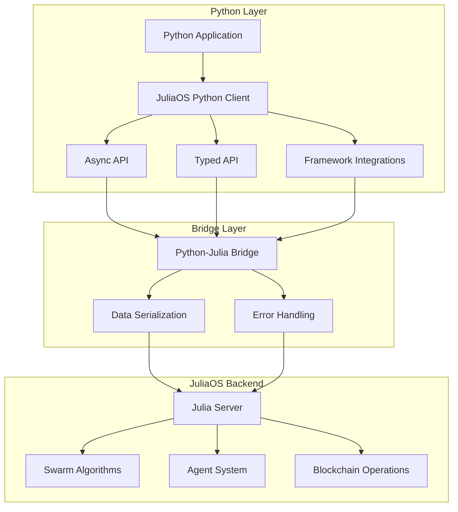

# JuliaOS Python Wrapper

This package provides a Python interface to JuliaOS, enabling Python developers to leverage JuliaOS's powerful swarm intelligence algorithms, agent systems, and blockchain integrations directly from Python code.

## Features

- Full access to JuliaOS functionality from Python
- Integration with popular Python AI frameworks (LangChain, HuggingFace)
- Async API for high-performance applications
- Type hints for improved developer experience
- Comprehensive examples and Jupyter notebooks
- Advanced workflow support for complex agent behaviors

## Installation

```bash
pip install juliaos
```

## Requirements

- Python 3.8+
- JuliaOS backend running locally or remotely

## Quick Start

```python
from juliaos import JuliaOS

# Initialize the client
juliaos = JuliaOS()

# Create a swarm
swarm = juliaos.create_swarm(
    algorithm="differential_evolution",
    population_size=50,
    dimensions=10,
    bounds=(-10, 10)
)

# Define an objective function
def sphere(x):
    return sum(xi**2 for xi in x)

# Run optimization
result = swarm.optimize(
    objective=sphere,
    iterations=100,
    minimize=True
)

print(f"Best solution: {result.best_solution}")
print(f"Best fitness: {result.best_fitness}")
```

## Architecture

The JuliaOS Python wrapper is designed as a bridge between Python and the JuliaOS backend:



## API Overview

### Core Classes

- `JuliaOS`: Main client class for connecting to JuliaOS
- `Swarm`: Interface to swarm optimization algorithms
- `Agent`: Interface to agent creation and management
- `Wallet`: Interface to wallet management
- `Chain`: Interface to blockchain operations
- `DEX`: Interface to decentralized exchange operations

### Integrations

- `LangchainAgentWrapper`: Integration with LangChain
- `HuggingfaceWrapper`: Integration with HuggingFace models
- `AsyncIO`: Support for asynchronous operations

## Example: Working with Agents

```python
from juliaos import JuliaOS

# Initialize the client
juliaos = JuliaOS()

# Create an agent
agent = juliaos.create_agent(
    name="PriceAnalyzer",
    specialization="market_analysis",
    skills=["price_prediction", "trend_detection"]
)

# Define agent behavior
@agent.on_task("analyze_market")
async def analyze_market(data):
    # Agent logic here
    trends = await agent.skills.detect_trends(data)
    prediction = await agent.skills.predict_price(data, trends)
    return {
        "trends": trends,
        "prediction": prediction
    }

# Start the agent
agent.start()

# Send task to the agent
result = await agent.execute_task("analyze_market", data=market_data)
print(f"Analysis result: {result}")
```

## Example: DEX Operations

```python
from juliaos import JuliaOS

# Initialize the client
juliaos = JuliaOS()

# Connect a wallet (this is a simulated wallet for example purposes)
wallet = juliaos.connect_wallet(
    type="ethereum",
    private_key=os.environ.get("ETH_PRIVATE_KEY")
)

# Get a quote for a token swap
quote = await juliaos.dex.get_quote(
    chain="ethereum",
    from_token="ETH",
    to_token="USDC",
    amount="1.0"
)

print(f"Swap quote: {quote}")

# Execute the swap
if user_confirms(quote):
    tx = await juliaos.dex.swap(
        wallet=wallet,
        quote=quote
    )
    print(f"Transaction hash: {tx.hash}")
```

## Example: LangChain Integration

```python
from juliaos import JuliaOS
from juliaos.integrations import LangchainAgentWrapper
from langchain.llms import OpenAI

# Initialize the client
juliaos = JuliaOS()

# Create a swarm-optimized agent
agent = juliaos.create_agent(
    name="DataAnalyst",
    specialization="data_analysis",
    skills=["data_cleaning", "statistical_analysis"]
)

# Wrap with LangChain
llm = OpenAI(temperature=0)
langchain_agent = LangchainAgentWrapper(
    agent=agent,
    llm=llm,
    tools=[
        "data_cleaning",
        "statistical_analysis",
        "visualization"
    ]
)

# Use the agent in a LangChain chain
result = langchain_agent.run(
    "Analyze this dataset and provide insights about the price trends."
)
```

## Async Support

JuliaOS Python wrapper provides full async support for high-performance applications:

```python
import asyncio
from juliaos import JuliaOS

async def main():
    # Initialize the client
    juliaos = JuliaOS()
    
    # Create multiple agents
    agents = [
        await juliaos.create_agent(name=f"Agent{i}")
        for i in range(10)
    ]
    
    # Run tasks concurrently
    tasks = [
        agent.execute_task("market_analysis", market="ETH/USDC")
        for agent in agents
    ]
    
    results = await asyncio.gather(*tasks)
    
    # Process results
    for i, result in enumerate(results):
        print(f"Agent {i} result: {result}")

# Run the async function
asyncio.run(main())
```

## Configuration

The wrapper can be configured through environment variables, a configuration file, or programmatically:

```python
from juliaos import JuliaOS, Config

# Configure through constructor
juliaos = JuliaOS(
    backend_url="http://localhost:8000",
    api_key="your-api-key",
    log_level="info"
)

# Or using Config class
config = Config(
    backend_url="http://localhost:8000",
    api_key="your-api-key",
    log_level="info"
)
juliaos = JuliaOS(config=config)

# Or from environment variables
# JULIAOS_BACKEND_URL, JULIAOS_API_KEY, JULIAOS_LOG_LEVEL

# Or from configuration file
# ~/.juliaos/config.json or specified path
juliaos = JuliaOS.from_config_file("path/to/config.json")
```

## Error Handling

The wrapper provides structured error handling with detailed context:

```python
from juliaos import JuliaOS
from juliaos.exceptions import JuliaOSError, ValidationError

try:
    juliaos = JuliaOS()
    result = juliaos.create_swarm(algorithm="invalid_algorithm")
except ValidationError as e:
    print(f"Validation error: {e.message}")
    print(f"Field: {e.field}")
    print(f"Details: {e.details}")
except JuliaOSError as e:
    print(f"Error: {e.message}")
    print(f"Error code: {e.code}")
    print(f"Stack trace: {e.stack_trace}")
```

## Development

### Setup Development Environment

```bash
# Clone the repository
git clone https://github.com/juliaos/juliaos.git
cd juliaos/packages/python-wrapper

# Create a virtual environment
python -m venv venv
source venv/bin/activate  # On Windows: venv\Scripts\activate

# Install dependencies
pip install -e ".[dev]"
```

### Running Tests

```bash
# Run tests
pytest

# Run tests with coverage
pytest --cov=juliaos
```

### Building Documentation

```bash
# Build documentation
cd docs
make html
```

## License

MIT
